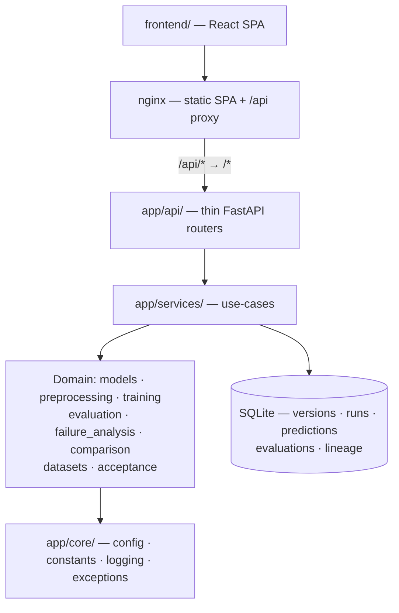

# Cloud Masking Across Thin Cloud, Haze, Snow and Bright Surfaces

An end-to-end deep-learning system for **four-class cloud segmentation in Sentinel-2 imagery** —
separating *clear*, *thick cloud*, *thin cloud*, and *cloud shadow* — built around the cases that
actually break cloud masks: semi-transparent cloud and bright surfaces such as snow, sand and rooftops.

Dataset pipeline → U-Net & Attention U-Net → training, evaluation and failure analysis → REST API →
React dashboard → degraded-mode/recovery guardrails → acceptance harness → Docker deployment.

**KL University two-semester engineering capstone (CP1 + CP2).**

---

## Why this problem

A cloud mask decides which pixels enter every downstream analysis, so its errors propagate silently.
The difficulty is not uniform: thick opaque cloud is easy, while **thin cloud mixes surface and cloud
signal inside a single pixel** and cloud shadow is defined by illumination geometry as much as by
spectral response.

How hard? On this dataset, *expert human annotators* reached 95.7% agreement overall but only **78%
producer's accuracy on thin cloud** — it is the class trained specialists disagree about most
([Aybar et al. 2022](https://doi.org/10.1038/s41597-022-01878-2)). That single fact shapes the whole
project: thin cloud is the **primary metric**, and aggregate accuracy — which is dominated by easy
pixels — is never allowed to stand in for it.

## The result

> On a bounded 32-sample expert-labelled CloudSEN12+ subset (3 seeds, everything held identical except
> the architecture), **Attention U-Net improved thin-cloud IoU in all 3 seeds (mean +0.050)** at
> **×1.012** parameters — and **regressed cloud-shadow IoU in all 3 seeds (mean −0.018)**.
> The decision framework returned IMPROVED for one seed and REGRESSION for two.
>
> ### Overall verdict: **MIXED** — not a win.

This is deliberately *not* summarised as "Attention U-Net is better," because the evidence does not
support that. Full analysis: **[the paper](paper/00_RESEARCH_PAPER.md)** ·
[measured results](paper/04_RESULTS.md) · [source record](docs/comparison/real_experiment_cloudsen12.md).

### What is and is not measured

| Status | What |
|---|---|
| **REAL (bounded)** | The M11 comparison above — 32 samples, 1 config, 12 epochs, 3 seeds. **Not** a benchmark. |
| **SYNTHETIC** | All API `/train` `/predict` `/evaluate` output; pipeline-validation runs. Always badged in the UI. |
| **DEMO** | Degraded mode, recovery, lineage replay. |
| **NOT YET MEASURED** | **Every formal KPI** (KPI-1..6, KPI-E1..E7) and AC-1/AC-3/AC-4 — these need a frozen-envelope dataset that does not exist locally. |
| **NOT EXECUTED** | All ablations; any comparison against published methods. |
| **NOT BUILT** | FR-2's `run_reference.sh` + independent oracle → independent reference validation is not executable *(known gap, see [audit](docs/planning/10_DOCUMENTATION_AUDIT.md))*. |

Nothing is ever fabricated to fill a table. An empty cell is reported as a finding.

---

## Quick start

**Docker — the whole system, one command:**

```bash
docker compose -f docker/docker-compose.yml up -d --build
```

UI → <http://localhost:8080> · API + Swagger → <http://localhost:8000/docs>

**Host development:**

```bash
cd backend && python3.11 -m venv .venv && source .venv/bin/activate && pip install -r requirements-dev.in
cd ../frontend && npm install && npm run dev
```

Full instructions, configuration and troubleshooting → **[installation guide](docs/install/README.md)**.

## What it does

| Capability | Detail |
|---|---|
| **Dataset pipeline** | CloudSEN12+ (CC0) acquisition, checksum verification, ROI-grouped leakage-free stratified splits, train-only normalization, and a `is_experiment_ready()` readiness gate that blocks experiments on unvalidated data |
| **Models** | U-Net baseline (484,228 params) and Attention U-Net (490,005) sharing one abstraction, registry and factory — only the skip path differs |
| **Training** | Config-driven trainer: AdamW/cosine, callbacks, checkpointing, deterministic seeding, recorded device |
| **Evaluation** | Confusion-matrix-first; per-class IoU/Dice/precision/recall/F1 plus stratified metrics. Undefined metrics stay undefined — never silently zero |
| **Failure analysis** | Error taxonomy with an explicit *measurability* status per category, deterministic ranking, per-class false-negative accounting |
| **Controlled comparison** | Fairness guardrails, thin-cloud-primary decision framework that classifies an aggregate gain hiding a worse class as a **REGRESSION** |
| **REST API** | FastAPI — 15 endpoints, SQLite persistence, request telemetry, Swagger |
| **Web UI** | React 18 + TypeScript (strict) + Vite; 12 pages; every result badged with its evidence status |
| **Safety guardrails** | Degraded mode + recovery, complete lineage, idempotent replay; **NT-1..NT-5 all pass** |
| **Deployment** | Two containers, health-gated startup, named-volume SQLite, nginx `/api` proxy that survives a backend restart |

## Architecture

Dependencies point **inward** — domain logic never depends on delivery mechanisms.



The rule that keeps this honest: **routers hold no domain logic, and services never reimplement a domain
package.** No second trainer, no second metric, no second degraded-mode system.

Detail → [architecture](docs/planning/03_ARCHITECTURE.md) · [developer guide](docs/developer_guide/README.md).

## Documentation

**Start at [`docs/README.md`](docs/README.md)** — the index.

| I want to… | Read |
|---|---|
| Install and run it | [Installation guide](docs/install/README.md) |
| Use the application | [User manual](docs/user_guide/README.md) |
| Change the code | [Developer guide](docs/developer_guide/README.md) |
| Call the API | [API reference](docs/api/README.md) *(generated from OpenAPI)* |
| Deploy it | [Deployment guide](docs/deployment/README.md) |
| Read the research | [Paper](paper/00_RESEARCH_PAPER.md) · [literature review](paper/01_LITERATURE_REVIEW.md) · [references](paper/references.bib) |
| Review it *(O5)* | [Package manifest](docs/MANIFEST.md) · [acceptance harness](docs/acceptance/README.md) · [KPIs & negative tests](docs/planning/06_KPI_ACCEPTANCE.md) |
| Understand a decision | [ADR-0001 … ADR-0019](docs/adr/) |

## Verify

`pytest` is intentionally not installed, so every test file also runs standalone:

```bash
backend/.venv/bin/python backend/scripts/run_acceptance.py       # NT-1..NT-5, non-zero on failure
backend/.venv/bin/python backend/tests/test_paper.py             # research-evidence integrity
backend/.venv/bin/python backend/tests/test_documentation.py     # docs complete & consistent
backend/.venv/bin/python backend/tests/test_deployment.py        # deployment contract (no daemon needed)
backend/.venv/bin/python backend/scripts/verify_deployment.py    # probes a running stack
```

Several project claims are enforced as tests rather than asserted in prose: that the docs are
consistent, that the deployment contract holds, and that **no paper number drifts from its source
record**.

## Tech stack

**Backend** Python 3.11 · FastAPI · PyTorch (CPU/MPS — no CUDA) · SQLAlchemy 2.0 · rasterio/GDAL · NumPy
**Frontend** React 18 · TypeScript 5 (strict) · Vite 6 · axios · Leaflet
**Infra** Docker + Compose · nginx · SQLite

Environment: **Python 3.11.x only** ([ADR-0004](docs/adr/ADR-0004-python-runtime.md)), **Node ≥ 20**,
Apple Silicon (MPS) or CPU ([ADR-0002](docs/adr/ADR-0002-compute-environment.md)).

## Repository layout

```
backend/     FastAPI + PyTorch — app/ (18 packages) · scripts/ (22 CLIs) · tests/ · configs/
frontend/    React + TypeScript + Vite SPA
docker/      Dockerfiles · compose · nginx template · pinned runtime deps
docs/        index · guides (install/user/developer/api/deployment) · planning · ADRs · manifest
paper/       research paper · literature review · comparison table · ablation template · BibTeX
data/        manifests + metadata tracked; payloads git-ignored
models/      checkpoints (git-ignored)
outputs/     SQLite · uploads · reports (git-ignored)
```

## Datasets

| Dataset | Role | Licence |
|---|---|---|
| **CloudSEN12+** | Primary — 4-class expert-labelled Sentinel-2 | **CC0-1.0** (redistribution permitted) |
| **On Cloud N** | Reference benchmark only | Competition terms — **redistribution prohibited**, kept git-ignored |

No dataset ships with this repository and the deployment image deliberately cannot download one.
See [dataset guide](docs/datasets/README.md) and [licences](docs/datasets/licenses.md).

## Project status

**Milestone 19 of 20 complete** — the research paper. The system is fully operable and containerized;
the remaining work is the final presentation package (M20) plus the independent-acceptance blockers
listed under [evidence status](#what-is-and-is-not-measured).

```
✅ M1  Planning              ✅ M8   Evaluation            ✅ M15 Integration
✅ M2  Scaffold              ✅ M9   Failure analysis      ✅ M16 Acceptance harness (D5)
✅ M3  Dataset management    ✅ M10  Attention U-Net       ✅ M17 Docker deployment
✅ M4  Preprocessing         ✅ M11  Controlled comparison ✅ M18 Documentation (D6)
✅ M5  Visualization & EDA   ✅ M12  Dataset pipeline      ✅ M19 Research paper (D7)
✅ M6  Baseline U-Net        ✅ M13  Backend API           ⬜ M20 Presentation & final delivery
✅ M7  Training engine       ✅ M14  Frontend
```

Full history and per-milestone exit criteria → [milestone plan](docs/planning/07_MILESTONE_PLAN.md).

## Licence

**TBD** — to be confirmed by the repository owner before any public release
(`backend/pyproject.toml`). Third-party dependencies are MIT/BSD/Apache-2.0; dataset licences are above.

## Git

The repository owner is the **sole Git author**. This project performs no Git operations; suggested
commands are listed in each milestone completion report for the owner to run manually.
