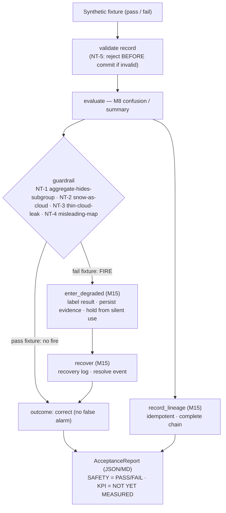

# Acceptance Harness (D5) — Guardrails & Negative Tests

Milestone 16 delivers **Deliverable D5**: the acceptance harness that proves the project's
safety/acceptance properties — the five mandatory negative tests **NT-1..NT-5** — and reports AC-1..4 + KPI
status. It **reuses** M8 evaluation (confusion matrix), M9 failure categories, and the M15
degraded-mode/recovery/lineage infrastructure — **no duplicated metric or degraded-mode system**. Decisions:
[ADR-0016](../adr/ADR-0016-acceptance-harness.md).

> **Honesty:** the harness proves the safety properties on **SYNTHETIC** fixtures. It never computes or
> fabricates real KPIs — the KPI/AC-4 rows are **NOT YET MEASURED** (they need a real frozen-envelope
> dataset). The bounded M11 real-data conclusion remains **MIXED** and is untouched.

## Flow: input → validation → evaluation → guardrail → violation/pass → degraded → lineage → recovery → result



## The five negative tests

| NT | Condition | Detection (reused / new) | Fail-fixture action |
|----|-----------|--------------------------|---------------------|
| **NT-1** | Overall accuracy dominated by easy pixels | **M15** `check_aggregate_hides_subgroup` | degraded → recovery |
| **NT-2** | Snow (true `clear`) masked as cloud | **new** over M8 confusion (`clear→cloud` rate) | degraded → recovery |
| **NT-3** | Thin cloud leaking into analysis | **new** over M8 confusion (`thin→clear` rate) | degraded → recovery |
| **NT-4** | A map hides uncertainty / coverage / resolution | **new** over map metadata | degraded → recovery |
| **NT-5** | Field/authoritative observations don't support the inference | **M15** lineage (`idempotent_get_or_create`) | rejected **before commit** |

Each NT has a **deterministic pass fixture** (must NOT fire) and **fail fixture** (must fire). An NT passes
acceptance only when **both** behave correctly — preventing silent-pass *and* false-alarm failures. Every
outcome is fully explainable: **requirement / observed / expected / evidence / action**.

## Modules

| Module | Responsibility |
|--------|----------------|
| `app/acceptance/fixtures.py` | Deterministic SYNTHETIC pass/fail fixtures (summaries, confusion matrices, map metadata, records). |
| `app/acceptance/guardrails.py` | NT-1 (reuse M15), NT-2/NT-3 (M8 confusion), NT-4 (map metadata) detections. |
| `app/acceptance/harness.py` | `run_acceptance` — runs all NTs, drives M15 degraded/recovery + lineage, builds the report. |
| `app/acceptance/records.py` | `GuardrailOutcome`, `NTResult`, `AcceptanceReport` (deterministic content hash). |
| `app/acceptance/report.py` | JSON/CSV/Markdown export (reuses the M5 `Report`). |
| `scripts/run_acceptance.py` | CLI — writes reports, prints per-NT summary, **exits non-zero on any failure**. |
| `app/api/routers/acceptance.py` | `GET /acceptance` — surfaces the report; frontend **Acceptance** page. |

## Verdict semantics

- **SAFETY_PASS_KPI_NOT_YET_MEASURED** — every NT passed; real KPI/AC-4 acceptance not yet measured.
- **SAFETY_FAIL** — at least one NT failed (a violation went undetected, or a healthy fixture falsely fired).

The project's full **Pass Contract** (every KPI passes under AC-1 & AC-4, every guardrail holds, all five NTs
pass, with independent AC-3 evidence) is therefore **not** satisfiable until a real AC-4 dataset exists — the
harness reports this honestly rather than claiming a pass.

## CLI / API

```bash
backend/.venv/bin/python backend/scripts/run_acceptance.py --output outputs/acceptance   # exit 0 / non-zero
# or, with the API running:  GET /api/acceptance
```

## Limitations / deferred

Safety proven on synthetic fixtures only; NT-2/NT-3 are pixel-level (confusion-based; spatial
connected-component refinement is DEFERRED, consistent with M9); KPI/AC-4 acceptance **NOT YET MEASURED**;
line-coverage % via `pytest-cov` is **DEFERRED** (not installed) — coverage is reported as a test-inventory /
NT coverage matrix instead. Docker/compose packaging is **M17**.
