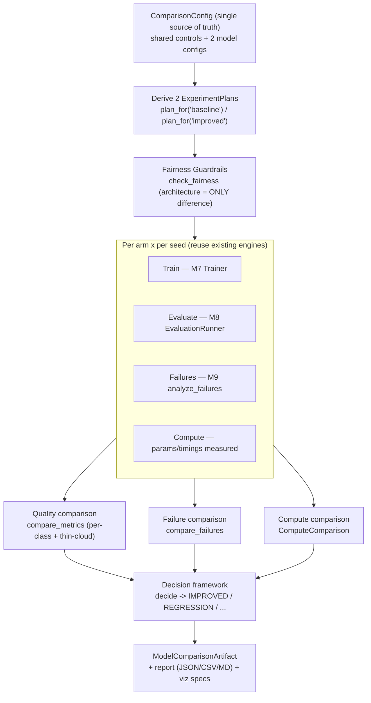

# Controlled Model Comparison

Milestone 11 delivers the **controlled comparison** layer under `backend/app/comparison/`. It runs a
scientific, **fair** baseline-vs-improved comparison (U-Net vs Attention U-Net) by **reusing** the existing
engines — the M7 `Trainer`, the M8 `EvaluationRunner`, and the M9 `analyze_failures` — with **no second
training engine, metrics system, or failure framework**. Decisions:
[ADR-0011](../adr/ADR-0011-model-comparison.md).

> **The primary question is not "who scores higher".** It is: *does Attention U-Net provide a meaningful
> improvement over the baseline — particularly for **thin cloud** and other difficult cases — for a
> reasonable compute cost?* Attention U-Net is **not** assumed to win.

> **Honesty.** No real dataset exists yet, so real-data quality is **NOT YET MEASURED** and the decision is
> **INCONCLUSIVE**. The `--synthetic-smoke` path trains both real architectures on small synthetic tensors
> so the full pipeline + compute are genuinely exercised (compute **MEASURED**), but quality is
> **SYNTHETIC / VALIDATION ONLY** — never a benchmark. IoU/Dice/F1/time/memory/significance are never
> fabricated.

## Comparison workflow



## Modules

| Module | Responsibility |
|--------|----------------|
| `config.py` | `ComparisonConfig` (single source of shared controls + both models) and `ExperimentPlan`; `config_hash` / `fairness_hash`. |
| `guardrails.py` | `check_fairness` — detects any accidental non-architectural difference; `FairnessReport`. |
| `records.py` | Typed records: `ComputeMeasurement`/`ComputeComparison`, `MetricComparison`/`ThinCloudComparison`, `FailureComparison`, `ExperimentRecord`, `ModelComparisonArtifact`. |
| `metrics.py` | `compare_metrics` / `extract_thin_cloud` — compares **already-computed** M8 results (no recomputation). |
| `failures.py` | `compare_failures` / `summarize_arm` — compares **M9** results (no re-implementation). |
| `decision.py` | `decide` → `DecisionOutcome`; thin-cloud-primary, compute-aware, honesty-gated. |
| `runner.py` | `ComparisonRunner` — reuses M7/M8/M9; synthetic-smoke & real regimes; assembles the artifact. |
| `viz_specs.py` | Backend-independent comparison `FigureSpec`s (reuses M5; **no matplotlib**). |
| `report.py` | JSON/CSV/Markdown reports (reuses the M5 `Report` model). |
| `serialization.py` | Save/load the `ModelComparisonArtifact`. |

## Fairness controls

Both arms are **derived from one `ComparisonConfig`**, so they are identical by construction; the guardrails
then re-verify every control and raise `GuardrailViolation` on any mismatch. The comparison **fails** if any
of these differ: dataset, dataset/preprocessing version, split, seed, loss, optimizer, scheduler, batch
size, training budget, augmentation, normalization, class weighting, checkpoint/early-stopping policy,
device, evaluation config. The **only** allowed difference is the model architecture/config.

- `fairness_hash` — hash of the shared controls only (identical for both arms).
- `config_hash` — hash of the whole comparison (shared controls + both architectures + seeds).

## Experiment matrix (intended)

| Model | Seed 1 | Seed 2 | Seed 3 |
|-------|:------:|:------:|:------:|
| U-Net (baseline) | ⬜ NOT YET MEASURED | ⬜ NOT YET MEASURED | ⬜ NOT YET MEASURED |
| Attention U-Net (improved) | ⬜ NOT YET MEASURED | ⬜ NOT YET MEASURED | ⬜ NOT YET MEASURED |

Same dataset / split / preprocessing / training config / evaluation config across every cell — only the
architecture changes. Rows are marked complete **only when actually executed on real data**. (The synthetic
smoke exercises this matrix on synthetic tensors for pipeline validation only.)

## Metric definitions

Metrics come from **M8** (`app.evaluation`), not recomputed here. Per class: **IoU**, **Dice**,
**Precision**, **Recall**, **F1** (+ pixel accuracy where meaningful). Aggregates: **macro**, **micro**,
**weighted**. Classes: `clear`, `thick_cloud`, `thin_cloud`, `cloud_shadow`. Undefined metrics stay
explicitly `undefined` (never silent zeros). Deltas are `improved − baseline`.

## Thin-cloud emphasis (PRIMARY)

Thin cloud is the primary comparison target and can **never** be hidden by an aggregate. `ThinCloudComparison`
surfaces thin-cloud **IoU / Dice / Recall** and **false-negatives** for both arms plus deltas and a
`regressed` flag. If the aggregate improves but thin cloud regresses, the decision is **REGRESSION**, not an
improvement.

## Compute measurement methodology

Compute is **measured, never inferred from parameter count**. Recorded per arm: parameter count &
trainable count (**MEASURED**), total training duration, average epoch duration, inference duration
(**MEASURED** on real / **SYNTHETIC** on synthetic data), device, batch size. Peak memory is
`NOT_MEASURED` on cpu/mps (captured only where reliable, e.g. CUDA); FLOPs are `DEFERRED`.
`ComputeComparison` reports parameter/time ratios so **quality and cost stay separate**.

## Failure-analysis integration

Each arm's **M9** `FailureAnalysisResult` is summarised (`summarize_arm`) into total failures, thin-cloud
failures, false positives/negatives, class confusion, severity distribution, and top-K categories.
`compare_failures` compares the arms and tests the architectural **hypothesis** ("attention gates improve
difficult thin-cloud discrimination") — marked *supported* **only** on real MEASURED evidence, otherwise
`None` (NOT YET MEASURED).

## Decision framework

`decide(...)` returns exactly one outcome, considering (in priority) thin-cloud IoU/Dice, macro
performance, worst-class behaviour, M9 failures, compute cost, and reproducibility:

| Outcome | When |
|---------|------|
| `IMPROVED` | Thin-cloud **and** aggregate improve beyond tolerance at acceptable compute cost. |
| `REGRESSION` | Thin-cloud (or worst class) regresses — even if the aggregate rose. |
| `COMPUTE_UNJUSTIFIED` | Only a slight thin-cloud gain but substantially more compute. |
| `NO_SIGNIFICANT_IMPROVEMENT` | Neither thin-cloud nor aggregate moves beyond tolerance. |
| `INCONCLUSIVE` | No real controlled results (synthetic / missing data), or insufficient evidence. |

Overall accuracy alone is **never** the criterion. Fewer than two seeds ⇒ significance `NOT_MEASURED`
(no fabricated confidence intervals).

## Reproducibility

Deterministic `config_hash` / `fairness_hash` / artifact `content_hash` (the last ignores timestamps &
notes). Every arm records its experiment id, model id, model/training/evaluation/failure config hashes, and
model/training artifacts (reused from M6/M7). Seeding is deterministic (M7 `set_seed`); environment is
captured via M7 `capture_environment`.

## CLI

```bash
python backend/scripts/compare_models.py --synthetic-smoke --epochs 1 --patch 16 --seeds 1 2 3
```

Flags: `--baseline`, `--improved`, `--config`, `--output`, `--device`, `--seed` / `--seeds`,
`--synthetic-smoke`. Outputs: `comparison_artifact.json`, `comparison_report.{json,csv,md}`,
`comparison_viz_specs.json`, plus a printed model-by-model table, compute comparison, failure comparison,
and the decision. Synthetic mode is **clearly labelled** and can never be confused with a benchmark.

## Limitations

- **Real-data quality: NOT YET MEASURED** (no processed dataset present; the runner never downloads).
- Synthetic smoke results are **SYNTHETIC / VALIDATION ONLY** — not a benchmark, not real-data performance.
- **Peak memory / FLOPs: NOT MEASURED** on cpu/mps (never inferred from parameters).
- Statistical significance is **NOT MEASURED** until ≥ 2 seeds run on real data; no CIs are fabricated.
- The decision stays **INCONCLUSIVE** until real controlled training + evaluation is executed.
