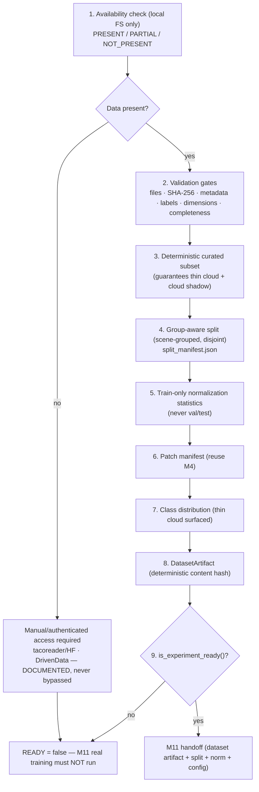
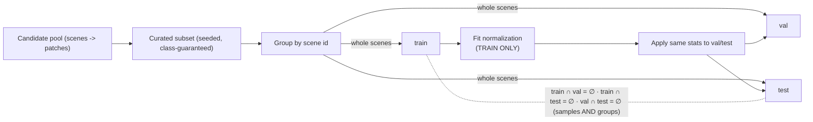

# Experimental Dataset & Reproducible Data Pipeline

Milestone 12 delivers the **experimental-dataset readiness pipeline** under `backend/app/datasets/`. It
moves the project from *"dataset infrastructure exists"* to *"a verified, reproducible, legally usable,
locally available experimental dataset exists"* — or, when the data is absent, an honest `NOT_PRESENT`
readiness verdict that refuses to hand an invalid dataset to M11. It **reuses** M3 (provenance/integrity),
M4 (splitting/patching/normalization), and M5 (statistics/QC) — **no second downloader, validator, or
splitter**. Decisions: [ADR-0012](../adr/ADR-0012-experimental-dataset-and-data-pipeline.md).

> **Honesty.** M12 is a **dataset / experiment-readiness** milestone — it claims **no** model performance
> (no U-Net / Attention U-Net superiority, no real IoU/Dice/F1). Real model quality remains **NOT YET
> MEASURED**. Real CloudSEN12 is currently **NOT PRESENT** (and rasterio/tacoreader are not installed), so a
> loudly-labelled **SYNTHETIC / PIPELINE VALIDATION ONLY / NOT REAL DATA / NOT A BENCHMARK** fixture
> exercises the pipeline. A synthetic fixture is never called a real dataset and is never merged into the
> real provenance manifest.

## Acquisition lifecycle (acquisition → validation → preprocessing → readiness)



## Split / data-flow pipeline (leakage prevention)



## Dataset readiness state machine

`NOT_PRESENT` → (data arrives) → `INCOMPLETE` / `INVALID` (fix) → `READY_WITH_WARNINGS` / `READY`. The
`is_experiment_ready()` gate is `READY` only when **all** critical gates pass:

| Gate | Meaning |
|------|---------|
| `validation_ok` | overall validation is READY / READY_WITH_WARNINGS |
| `required_files_exist` | every image + label file is present |
| `checksums_not_failed` | no SHA-256 mismatch (missing checksums are a warning, not a failure) |
| `labels_valid` | labels within `[0, num_classes)` and required classes present |
| `dimensions_valid` | consistent raster/label dimensions |
| `splits_disjoint` | no sample **or** scene shared across train/val/test |
| `required_classes_exist` | clear / thick / thin / shadow all present |
| `thin_cloud_exists` | thin-cloud pixels present (O2/O3) |
| `normalization_stats_exist` | train-only statistics fitted |
| `patch_manifest_exists` | patches generated |
| `preprocessing_version_recorded` / `dataset_version_recorded` | provenance/versioning present |
| `licensing_acceptable` | redistribution not prohibited for the primary dataset |

## Modules

| Module | Responsibility |
|--------|----------------|
| `experimental_config.py` | `ExperimentalDatasetConfig` (+ deterministic `config_hash`). |
| `availability.py` | Local-FS availability (PRESENT / PARTIAL / NOT_PRESENT). |
| `records.py` | `ExperimentalDatasetRecord`, `DatasetValidationReport`, `SubsetSelection`, `ExperimentalSplitManifest`, `ClassDistributionReport`. |
| `validation_gates.py` | `validate_experimental_dataset` → `DatasetValidationReport` (reuses M3 integrity). |
| `sampling.py` | `select_subset` + `build_split_manifest` (reuses M4 `split_samples`). |
| `dataset_statistics.py` | `class_distribution_report` + train-only `fit_normalization` (reuses M4). |
| `artifact.py` | Canonical `DatasetArtifact` (deterministic content hash). |
| `readiness.py` | `is_experiment_ready` gate + `build_handoff` (M11). |
| `pipeline.py` | `prepare_experimental_dataset` orchestration (synthetic / real). |
| `synthetic.py` | Labelled synthetic fixture (PIPELINE VALIDATION ONLY, no rasterio). |

## Provenance & licensing / access

`data/manifests/datasets.yaml` (M3) remains the single provenance source and is **not rewritten**. The
experimental record adds *observed* values alongside it; unknowns stay explicit (`UNKNOWN` / `NOT_VERIFIED`
/ `NOT_AVAILABLE`). CloudSEN12/CloudSEN12+ = **CC0-1.0** (redistribution permitted; raw still git-ignored to
bound repo size). On Cloud N redistribution is **PROHIBITED** — never auto-downloaded, never primary. Access
(tacoreader/Hugging Face; DrivenData registration) is a **documented manual workflow**; access controls are
never bypassed and no credentials are committed.

## Integrity validation

SHA-256 per file (M3 `compute_checksum` / `verify_checksum`), plus file-existence, metadata, label-range,
dimension, band-count, and completeness checks — surfaced as a structured `DatasetValidationReport`
(`READY` / `READY_WITH_WARNINGS` / `INCOMPLETE` / `INVALID` / `NOT_PRESENT`).

## Subset selection, splitting, normalization, class balance

- **Subset:** deterministic from `(seed, subset_size, strategy)`, guaranteeing thin-cloud/cloud-shadow
  presence; labels are used only to guarantee class presence in the pool, never to construct the split.
- **Split:** group-aware by scene (M4), disjoint at both sample and scene level, persisted with a config
  hash.
- **Normalization:** fitted on **train only**; the same statistics are applied to val/test (no leakage).
- **Class balance:** the real per-class distribution is reported with **thin cloud surfaced** and severe
  imbalance flagged; the data distribution is never silently altered (rebalancing is a training-time
  concern, R-16).

## Artifact structure

`DatasetArtifact` bundles: `dataset_id`, `dataset_version`, `manifest_version`, `preprocessing_version`,
`config_hash`, `subset_selection_hash`, `split_manifest_hash`, `normalization_statistics_hash`,
`validation_report`, `class_distribution`, `dataset_record`, sample/patch/train/val/test counts,
`data_regime`, `created_at`, `notes`, and a deterministic `content_hash` (ignores timestamps/notes).

## M11 handoff

`build_handoff` produces a small, isolated `ExperimentHandoff` M11 consumes **without any change to M11
logic**: it carries the dataset artifact, split manifest, normalization statistics, versions, expected
input channels/classes, `data_regime`, and a ready-to-run M11 `ComparisonConfig`. A `SYNTHETIC` handoff
keeps M11's decision **INCONCLUSIVE**.

## CLIs

```bash
python backend/scripts/validate_dataset.py --dataset cloudsen12
python backend/scripts/prepare_dataset.py --dataset cloudsen12 --synthetic-smoke --subset 24 --seed 1
```

Both distinguish `NOT PRESENT` / `INCOMPLETE` / `INVALID` / `READY`, never download silently, and label
synthetic runs as validation-only.

## Limitations

- **Real dataset: NOT PRESENT** (rasterio/tacoreader not installed; the pipeline never downloads).
- Synthetic-fixture outputs are **PIPELINE VALIDATION ONLY** — not a benchmark, not real data.
- Real-data label/dimension checks are **NOT VERIFIED** until rasterio is installed and data is present.
- Real model quality remains **NOT YET MEASURED** (that is M11 on a `READY` real dataset).
