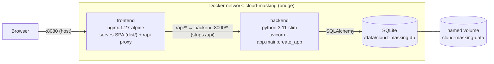

# Deployment & Clean‑Environment Guide (Milestone 17)

How the Cloud Masking system is containerized and run with Docker Compose. Design rationale:
[ADR‑0017](../adr/ADR-0017-deployment-containerization.md). Image/Compose files live in
[`../../docker/`](../../docker/).

> **Honesty:** the deployed system serves **SYNTHETIC/DEMO** results only (as in M13–M16). No REAL KPI
> is produced by containerization. All formal KPIs remain **NOT YET MEASURED**; the M11 real‑data
> conclusion remains **MIXED**. The backend image bundles **CPU PyTorch**, so `/train` and `/predict`
> run in‑container — but on **CPU only** (MPS is host‑only), so they are for *functional*, not
> benchmark, use.

## Topology



Request path: **Browser → nginx (SPA + reverse proxy) → FastAPI (uvicorn) → services (M6–M16) →
SQLite on a named volume.** The `/api/* → backend:8000/*` rewrite reproduces the Vite dev‑proxy exactly
(ADR‑0014), so the SPA's same‑origin `/api` contract holds in production with **no backend CORS change**.

## Services, ports, env, volumes

| Service | Image | Container port | Host port (env) | Health check |
|---------|-------|----------------|-----------------|--------------|
| `backend` | `cloud-masking-backend:0.17.0` (`docker/backend.Dockerfile`) | 8000 | `BACKEND_PORT` (default **8000**) | stdlib `urllib` GET `/health` |
| `frontend` | `cloud-masking-frontend:0.17.0` (`docker/frontend.Dockerfile`) | 80 | `FRONTEND_PORT` (default **8080**) | busybox `wget --spider /healthz` (nginx‑served) |

**Environment variables** (all have safe defaults; **no secrets**):

| Variable | Default | Effect |
|----------|---------|--------|
| `BACKEND_PORT` | `8000` | host port → backend:8000 |
| `FRONTEND_PORT` | `8080` | host port → frontend:80 |
| `LOG_LEVEL` | `INFO` | uvicorn/app log level |
| `APP_ENV` | `production` | `app.core.config` environment tag |
| `RUN_PROFILE` | `smoke` | run profile (`smoke`/`full`) |
| `API_HOST` | `0.0.0.0` (set by image) | bind all interfaces in‑container |
| `OUTPUTS_DIR` | `/data` (set by compose) | app outputs on the volume |
| `DATABASE_URL` | `sqlite:////data/cloud_masking.db` (set by compose) | SQLite DB on the volume |
| `MLFLOW_TRACKING_URI` | `file:/data/mlruns` (set by compose) | tracking dir on the volume |

**Volume:** the named volume **`cloud-masking-data`** is mounted at `/data`; the backend runs as a
non‑root user that owns `/data`, and the DB layer creates the parent dir + schema idempotently on
startup. Application state therefore **survives `docker compose down` / container replacement**. Use
`down -v` to discard it.

## Startup order & health/readiness

`frontend` declares `depends_on: backend { condition: service_healthy }`, so nginx starts only after
the backend's `/health` probe passes — the `backend` DNS name is then resolvable for the proxy.
| Probe | Where | What it proves |
|-------|-------|----------------|
| backend `HEALTHCHECK` | stdlib `urllib` GET `http://127.0.0.1:$API_PORT/health` | uvicorn is up, the app factory built, SQLite opened |
| frontend `HEALTHCHECK` | busybox `wget --spider /healthz` (served by nginx itself) | the SPA container is up — deliberately **independent** of backend state, so "frontend up / backend down" stays distinguishable |
| Compose gate | `condition: service_healthy` | the SPA is never served before the API can answer it |

Both services use `restart: unless-stopped`. The `/api` proxy survives a backend restart because
nginx **re-resolves** the upstream at request time (Docker's embedded DNS at `127.0.0.11` plus a
variable `proxy_pass`); a literal `proxy_pass http://backend:8000/` would cache the IP nginx saw at
boot and start failing the moment the backend container is replaced.

## Commands

Build, run, verify (from the repository root):

```bash
docker compose -f docker/docker-compose.yml build
docker compose -f docker/docker-compose.yml up -d
docker compose -f docker/docker-compose.yml ps
```

```bash
curl -fsS http://localhost:8000/health
curl -fsS http://localhost:8000/version
curl -fsS http://localhost:8080/api/health   # through the nginx /api proxy
```

Run the M16 acceptance harness **inside** the running backend container:

```bash
docker compose -f docker/docker-compose.yml exec backend python scripts/run_acceptance.py
```

Verify the running stack end-to-end — health, version, every M13–M16 route, SPA delivery, the `/api`
proxy, env-driven config, SQLite persistence and the D5 acceptance verdict. Exits non-zero on any
failure, so it can gate a release:

```bash
backend/.venv/bin/python backend/scripts/verify_deployment.py \
    --api-url http://localhost:8000 --frontend-url http://localhost:8080
```

Restart drill — persisted state must survive and the proxy must recover:

```bash
docker compose -f docker/docker-compose.yml restart backend
backend/.venv/bin/python backend/scripts/verify_deployment.py --wait 120 --restart-expect 1
```

Static deployment-contract checks (**no Docker daemon required**, so CI can run them anywhere):

```bash
backend/.venv/bin/python backend/tests/test_deployment.py
```

Clean‑environment rebuild (Risk R‑12 — no cache):

```bash
docker compose -f docker/docker-compose.yml build --no-cache
```

Tear down (keep data) / drop the data volume:

```bash
docker compose -f docker/docker-compose.yml down
docker compose -f docker/docker-compose.yml down -v
```

## Development vs deployment

- **Development (M13/M14):** `backend/.venv` + `scripts/serve_api.py` on `:8000`, Vite dev server on
  `:5173` with the `/api` proxy. Hot reload; MPS/torch available on the host for `/train` & `/predict`.
- **Deployment (M17):** two immutable images; nginx serves the pre‑built SPA and proxies `/api`
  (runtime DNS re‑resolution survives a backend restart); state persists on the named volume. Backend
  bundles **CPU torch** (MPS host‑only — see limitations).

## Known limitations

- **Container `torch` is CPU‑only** — **MPS acceleration is host‑only** (ADR‑0002). `/train` &
  `/predict` therefore run in‑container but slowly, and are for *functional*, not benchmark, use. The
  torch wheel also makes the backend image large (~430 MB wheel).
- Deliberately **not installed** (audited: zero import sites under `app/`): torchvision, torchmetrics,
  mlflow, opencv, scikit‑learn/image, pandas, scipy; `tacoreader` is excluded **by policy** (a
  deployment image must not pull datasets). No served endpoint needs them.
- Persistence is single‑file **SQLite** on a **local** named volume — right‑sized for this project, not
  a multi‑node datastore.
