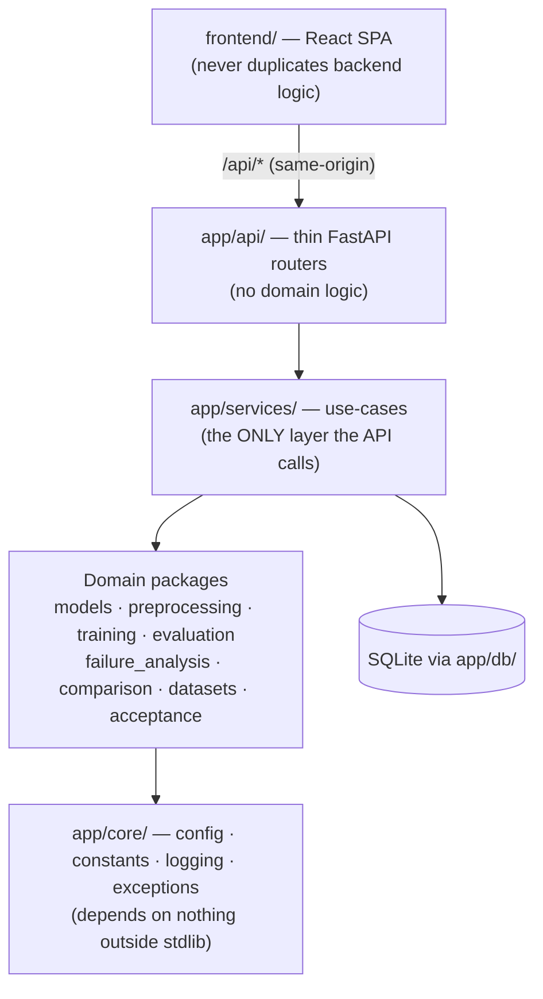

# Developer Guide

For someone who has the repository and needs to change it. Setup lives in the
[installation guide](../install/README.md); this document covers how the code is organised, the
conventions it holds to, and how to verify a change.

---

## Architecture in one minute

Dependencies point **inward**. Domain logic never depends on delivery mechanisms.



The rule that keeps this honest: **a router may not contain domain logic, and a service may not
reimplement a domain package.** If you find yourself writing a second trainer, a second metric, or a
second degraded-mode system, stop — reuse the existing one.

Full detail: [`03_ARCHITECTURE.md`](../planning/03_ARCHITECTURE.md).

### Who owns what

| Package | Milestone | Responsibility |
|---------|-----------|----------------|
| `app/core/` | M2 | Config, constants, logging, typed exceptions. **Stdlib only.** |
| `app/datasets/` | M3, M12 | Manifests, integrity, CloudSEN12+ access, readiness gate |
| `app/preprocessing/` | M4 | Bands, normalization, indices, patching, splitting, augmentation |
| `app/visualization/` | M5 | Backend-independent figure specs, statistics, reports |
| `app/models/` | M6, M10 | U-Net, Attention U-Net, registry, factory, metadata |
| `app/training/` | M7 | Trainer, optimizer/scheduler/loss, callbacks, checkpoints, seeding |
| `app/evaluation/` | M8 | Confusion matrix, per-class + stratified metrics |
| `app/failure_analysis/` | M9 | Taxonomy, pixel/sample errors, ranking |
| `app/comparison/` | M11 | Fair model comparison + decision framework |
| `app/inference/` | M13 | Tiled prediction + stitching |
| `app/api/`, `app/schemas/`, `app/db/` | M13 | Routers, Pydantic DTOs, SQLAlchemy models |
| `app/services/` | M13, M15 | Use-cases, lineage, integration/degraded/recovery |
| `app/acceptance/` | M16 | D5 harness — NT-1..NT-5 |

---

## Conventions

These are not stylistic preferences; they are what the existing code does, and a change that breaks
them will look foreign.

1. **`from __future__ import annotations` at the top of every module.**
2. **Typed dataclasses** for records, with `to_dict()` / `from_dict()`.
3. **Deterministic hashing** via `app.utils.hashing.stable_hash` — content hashes must be stable across
   processes so artifacts can be compared.
4. **Heavy imports are guarded and lazy.** `torch` goes through `app/models/_torch.py`; `matplotlib` and
   `albumentations` are imported inside the function that needs them. This keeps
   `import app.main` working on a bare interpreter — a contract enforced by `tests/test_imports.py`.
5. **Typed exceptions** from `app/core/exceptions.py`. No bare `except:`.
6. **No hard-coded paths.** Everything derives from `PROJECT_ROOT` or an environment override.
7. **Honesty labels are mandatory** on every quantity a user could mistake for a measurement:
   `MEASURED` / `SYNTHETIC` / `DEMO` / `NOT_MEASURED` / `NOT_YET_MEASURED` / `DEFERRED`.
8. **Each milestone adds a `<NAME>_VERSION` constant** in `app/core/constants.py`.

### The honesty rule, concretely

Never let a synthetic number reach a user as if it were real. If a value could not be measured, the
correct output is the explicit `NOT_YET_MEASURED` marker — not `0.0`, not a placeholder, not a plausible
guess. `tests/test_documentation.py` and `tests/test_deployment.py` both assert this and will fail if a
KPI is silently promoted.

---

## Running the tests

**`pytest` is deliberately not installed** in this project's venv. Every test file is therefore written
to run *both* under pytest and standalone, using a local `assert_raises` helper and a `__main__` runner:

```bash
backend/.venv/bin/python backend/tests/test_comparison.py            # M11 — 23
backend/.venv/bin/python backend/tests/test_datasets_experimental.py # M12 — 18
backend/.venv/bin/python backend/tests/test_api.py                   # M13 — 15
backend/.venv/bin/python backend/tests/test_integration.py           # M15 — 10
backend/.venv/bin/python backend/tests/test_acceptance.py            # M16 — 13
backend/.venv/bin/python backend/tests/test_deployment.py            # M17 — 34
backend/.venv/bin/python backend/tests/test_documentation.py         # M18
```

Whole-system gates:

```bash
backend/.venv/bin/python backend/scripts/run_acceptance.py      # NT-1..NT-5, non-zero on failure
backend/.venv/bin/python backend/scripts/verify_deployment.py   # probes a RUNNING stack
cd frontend && npm run build                                    # tsc --noEmit && vite build
```

When you add a test file or a script, add its path to `REQUIRED_FILES` in `tests/test_structure.py`.

---

## Adding things

### A new model architecture
1. Implement it in `app/models/`, reusing `blocks.py`.
2. Register it in `registry.py` — do **not** touch `unet.py` or `attention_unet.py`.
3. Add metadata + a parameter count; extend `tests/test_models.py`.
4. It becomes available through `/models` and `/train` automatically. **No API change is needed** — if
   you find yourself editing a router to add a model, the registry is being bypassed.

### A new endpoint
1. DTOs in `app/schemas/api.py`.
2. Use-case in `app/services/` — reuse the domain packages, do not reimplement them.
3. A **thin** router in `app/api/routers/`, registered in `app/main.py`.
4. Extend `tests/test_api.py`, then **regenerate the API reference**:
   ```bash
   backend/.venv/bin/python backend/scripts/generate_api_docs.py
   ```

### A new frontend page
1. `frontend/src/pages/`, plus a route and nav entry in `App.tsx` / `Layout`.
2. Call the API only through `src/services/api.ts` — never `axios` directly.
3. Reuse the M5 palette in `src/utils/colors.ts`; label every result.
4. `npm run build` must stay clean (`tsc --noEmit` runs first and blocks the build on any type error).

---

## Reproducibility (D6)

What is reproducible, and what is not — stated precisely rather than optimistically.

**Reproducible**
- **Dependencies.** `docker/requirements-backend.txt` is exactly pinned, including CPU torch from the
  PyTorch CPU index. `frontend/package-lock.json` pins the SPA. The image asserts its own imports at
  build time.
- **Seeds.** `RANDOM_SEED` (default 42) flows through `app/training/seed.py`; every run records the seed
  and the resolved device.
- **Content hashes.** Artifacts hash deterministically. The acceptance report's hash is identical on the
  host and inside the container (verified in M17) — the harness has no hidden state.
- **Splits.** The M12 pipeline produces a deterministic, ROI-grouped, leakage-checked split manifest.
- **Environment.** `docker compose build --no-cache` rebuilds from a clean checkout.

**Not reproducible / not yet built** — recorded honestly, not hidden:
- **Numerical parity across devices.** MPS and CPU can differ slightly; the device is always recorded so
  a result is never compared across envelopes by accident.
- **`scripts/run_reference.sh` and `app/evaluation/oracle.py`** — the FR-2 one-command reference path
  and the independent oracle are named in the requirements but **were never built** (M6–M9 scope). See
  [`10_DOCUMENTATION_AUDIT.md`](../planning/10_DOCUMENTATION_AUDIT.md).
- **A full transitive lock** (`pip-compile` output) for the host venv is still deferred; the container
  pin set is the reproducible one.
- **Real-data KPI runs.** Blocked on a frozen AC-4 dataset. All KPIs remain **NOT YET MEASURED**.

---

## Before you open a change

```bash
# 1. domain regressions
for t in comparison datasets_experimental api integration acceptance deployment documentation; do
  backend/.venv/bin/python backend/tests/test_$t.py | tail -1
done

# 2. import + structure contracts
backend/.venv/bin/python backend/tests/test_structure.py 2>/dev/null || true

# 3. frontend
cd frontend && npm run build

# 4. if you touched routers or DTOs
backend/.venv/bin/python backend/scripts/generate_api_docs.py --check

# 5. if you touched deployment
docker compose -f docker/docker-compose.yml build
backend/.venv/bin/python backend/scripts/verify_deployment.py
```

Do not weaken a guardrail or an NT to make a test pass. If an NT fires, the finding is the point.

---

## Decision records

Every significant choice has an ADR in [`docs/adr/`](../adr/), numbered and dated. Write one before
implementing anything structural, and explain what you **rejected** and why — the rejected alternatives
are the most useful part of an ADR when someone revisits the decision later.
