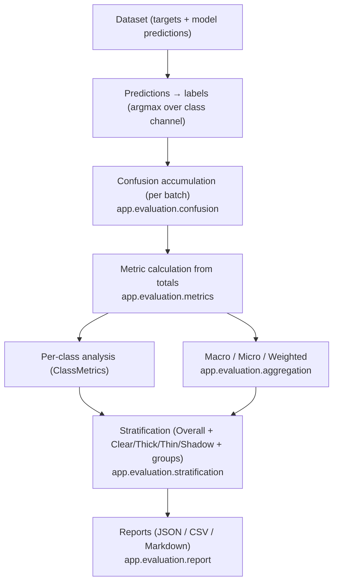

# Evaluation

Milestone 8 delivers the **evaluation framework** under `backend/app/evaluation/` — confusion-matrix-based,
**per-class-first** segmentation evaluation. **No model/training/inference/deployment/API code.** numpy is a
guarded optional dependency (needed only to accumulate/argmax arrays; metric math is pure standard library).
Decisions: [ADR-0008](../adr/ADR-0008-evaluation-strategy.md).

> **Critical property:** a strong overall score can **never conceal poor per-class (thin-cloud)
> performance** — per-class and stratified metrics are always produced; undefined metrics are explicit,
> never misleading zeros.

## Evaluation pipeline



## Modules

| Module | Responsibility |
|--------|----------------|
| `config.py` | `EvaluationConfig` (+ `EvaluationMode`) with deterministic `config_hash`; CloudSEN12/On Cloud N factories. |
| `confusion.py` | `ConfusionMatrix` (rows=true, cols=pred); accumulate/add; TP/FP/FN/TN. |
| `metrics.py` | Per-class IoU/Dice/Precision/Recall/F1 + pixel accuracy (explicit undefined). |
| `aggregation.py` | Macro / micro / weighted aggregation. |
| `records.py` | `MetricValue`, `ClassMetrics`, `EvaluationResult`, `EvaluationSummary`, `StratifiedResult`, `EvaluationRun`. |
| `runner.py` | `EvaluationRunner` — accumulate → compute → `EvaluationRun`. |
| `stratification.py` | Overall + per-class view + per-group results. |
| `summary.py` | `build_summary` (surfaces thin-cloud IoU + worst class). |
| `report.py` | Report builder (reuses `visualization.reports.Report`). |
| `serialization.py` | Save/load evaluation runs (JSON). |
| `binary.py` | Opt-in cloud-vs-clear label collapse (documented; never automatic). |

## Metric definitions (per class, from confusion counts)

| Metric | Formula | Undefined when |
|--------|---------|----------------|
| IoU / Jaccard | TP / (TP+FP+FN) | TP=FP=FN=0 (class absent in both) |
| Dice | 2·TP / (2·TP+FP+FN) | TP=FP=FN=0 |
| Precision | TP / (TP+FP) | no predicted positives |
| Recall | TP / (TP+FN) | class absent in ground truth |
| F1 | 2·P·R / (P+R) | P or R undefined, or P+R=0 |
| Pixel accuracy | Σ diag / Σ all | empty mask |

**Undefined values are represented explicitly** (`MetricValue(value=None, defined=False, reason=…)`) and
excluded from macro/weighted averages — the framework never turns undefined into a misleading zero.

## Class conventions

- **CloudSEN12 (multiclass):** `0=clear, 1=thick_cloud, 2=thin_cloud, 3=cloud_shadow` (verified M3).
- **On Cloud N (binary):** `0=no_cloud, 1=cloud`.
- **Confusion matrix:** **row = true class, column = predicted class.**
- **Haze is NOT a class** — approximated under thin cloud; no standalone KPI (Charter §3.1).

## Binary vs multiclass

Binary and four-class evaluation are **separate modes and never mixed** (`EvaluationConfig.on_cloud_n()` vs
`.cloudsen12()`). On Cloud N labels are already binary. For a deliberate cloud-vs-clear view of CloudSEN12,
`binary.collapse_to_binary` maps `{thick, thin}→cloud (1)` and `{clear, shadow}→non_cloud (0)` — an explicit,
opt-in choice that must be stated alongside any binary metrics.

## Aggregation strategy (why not average batch metrics)

Metrics are computed **from accumulated confusion totals**, never by averaging per-batch metrics, because a
ratio of sums ≠ a mean of ratios (e.g. IoU across batches with different class support). Confusion matrices
add exactly, so `metric(accumulate(b1)+accumulate(b2)) == metric(accumulate(all))` — proven by a test.

- **Macro** — mean over **defined** classes only (every class equal; thin cloud can't be hidden).
- **Micro** — from globally summed TP/FP/FN (= pixel accuracy for single-label).
- **Weighted** — by per-class support.

## Ignore labels

Pixels equal to `ignore_index` are excluded **before** counting, so ignored/no-data regions never affect
metrics.

## Stratification

Always: **Overall** + per-class **Clear / Thick Cloud / Thin Cloud / Cloud Shadow** (from the per-class
metrics), plus optional **by-group** breakdowns (dataset/split/region/season) via
`stratified_evaluation(config, grouped_batches)`.

## Report structure

`build_evaluation_report(run)` → sections: **Metadata** (model, dataset, split, config hash, evaluation
version, timestamp), **Overall**, **Per-class metrics**, **Aggregate metrics** (macro/micro/weighted),
**Confusion matrix**, and **Stratified (by group)**. Exports to **JSON / CSV / Markdown**.

## Uncertainty (deferred)

Confidence intervals / uncertainty are **deferred** (ADR-0008). M8 records **point metrics only** and does
not fabricate confidence estimates; CIs are computed on real-data runs in a later milestone.

## CLI

```bash
python backend/scripts/evaluate.py --mode multiclass --split test   # SYNTHETIC demo (not real metrics)
python backend/scripts/evaluate.py --mode binary --split test
```

The CLI runs on **synthetic** data by default (no real dataset); its outputs are explicitly labelled
**NOT real-data metrics**. No evaluation logic lives in the CLI — it delegates to `app.evaluation`.
