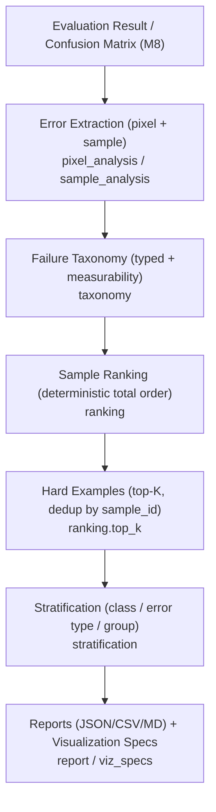

# Failure Analysis (Confusing-Case Evaluation)

Milestone 9 delivers the **failure-analysis** layer under `backend/app/failure_analysis/`. It **explains
model failures** on top of the M8 evaluation primitives — it does **not** recompute M8 metrics. It answers:
*when the model is wrong, what kind of case caused it?* **No model/training/inference/deployment/API/frontend
code.** numpy is guarded (needed only for sample-level array analysis). Decisions:
[ADR-0009](../adr/ADR-0009-confusing-case-analysis.md).

> **Honesty:** categories requiring information not in the pipeline (confidence → probabilities; edges /
> small objects → spatial masks) are marked **NOT MEASURABLE / DEFERRED**, never fabricated. No real data
> exists yet — all outputs are synthetic and labelled **NOT YET MEASURED**.

## Analysis flow



## Modules

| Module | Responsibility |
|--------|----------------|
| `taxonomy.py` | `FailureCategory`, `Measurability`, `Severity`; per-category measurability. |
| `config.py` | `FailureAnalysisConfig` (+ `SeverityThresholds`), deterministic `config_hash`. |
| `records.py` | `ErrorRecord`, `SampleFailure`, `HardExample`, `FailureSummary`, `FailureGroup`, `FailureAnalysisResult`. |
| `pixel_analysis.py` | Per-class FN/FP/confusion **from the M8 confusion matrix** (no recomputation). |
| `sample_analysis.py` | Per-sample failure records (reuses `ConfusionMatrix`); split isolation. |
| `ranking.py` | Deterministic ranking, dedup by sample id, top-K. |
| `stratification.py` | Failure summaries by class / error type / group. |
| `analyzer.py` | `analyze_failures` orchestration → `FailureAnalysisResult`. |
| `viz_specs.py` | Backend-independent confusing-case `FigureSpec`s (reuses M5; no matplotlib). |
| `report.py` | JSON/CSV/Markdown reports (reuses the visualization Report model). |

## Taxonomy & measurability

| Category | Measurability |
|----------|---------------|
| `false_positive`, `false_negative`, `class_confusion` | **MEASURABLE** |
| `clear_surface_failure`, `thick_cloud_failure`, `thin_cloud_failure`, `cloud_shadow_failure` | **MEASURABLE** (multiclass) |
| `edge_error`, `small_object_failure` | **DEFERRED** (needs spatial mask analysis) |
| `high_confidence_error`, `low_confidence_error` | **NOT MEASURABLE** (needs probabilities) |

## Severity

Evidence-based only (no probabilities available). Assigned from **error rate** with configurable
thresholds (defaults): `CRITICAL ≥ 0.75`, `HIGH ≥ 0.50`, `MEDIUM ≥ 0.25`, `LOW > 0`, `NONE = 0`.
Confidence-based severity is **unavailable**; confidence is never inferred from logits.

## Ranking & tie-breaking

Deterministic **total order**: 1) **severity** (desc), 2) **error_rate** (desc), 3) **error_count**
(desc), 4) **sample_id** (asc). Ranks are 1-based.

## Hard-example selection

Deterministic **top-K** by `error_rate` / `error_count` / per class (e.g. `thin_cloud`) / per error type,
with **K** from config. **Deduplication by `sample_id`** happens first (keep the worst per sample), so a
sample never occupies multiple slots. Hard examples are only **identified** — never oversampled/duplicated
for training.

## Split isolation

The analyzer refuses to mix splits: a sample whose `split` differs from the configured split raises
`FailureAnalysisError`. Patch-level entries group to their base `sample_id`. Reports never mix
train/validation/test.

## Confidence limitations

The pipeline stores **labels, not probabilities**, so confidence-based categories remain **NOT MEASURABLE**
and `confidence` fields are `None`. This is stated in every result's `limitations` and in reports.

## Report structure

`build_failure_report` → sections: **Metadata** (analysis + evaluation versions, model/dataset/split,
config hash, timestamp), **Failure taxonomy** (category + measurability), **Pixel-level errors**, **Class
summaries** (thin cloud visible), **Error-type summaries**, **Top-K hard examples**, **Limitations**
(labelled NOT MEASURABLE / DEFERRED / NOT YET MEASURED). Exports **JSON / CSV / Markdown**.

## Visualization specs

`confusing_case_specs` builds **backend-independent** `FigureSpec`s (ground truth, prediction, error
overlay) + a class legend, with error category / severity / sample metadata in the spec options. matplotlib
is **never** imported here — rendering stays behind the M5 backend abstraction.

## CLI

```bash
python backend/scripts/analyze_failures.py --mode multiclass --split test        # SYNTHETIC demo
python backend/scripts/analyze_failures.py --input outputs/evaluation/run.json   # pixel-level from M8
```

The CLI runs on **synthetic** data by default (labelled NOT real-data metrics). No analysis logic lives in
the CLI — it delegates to `app.failure_analysis`.
