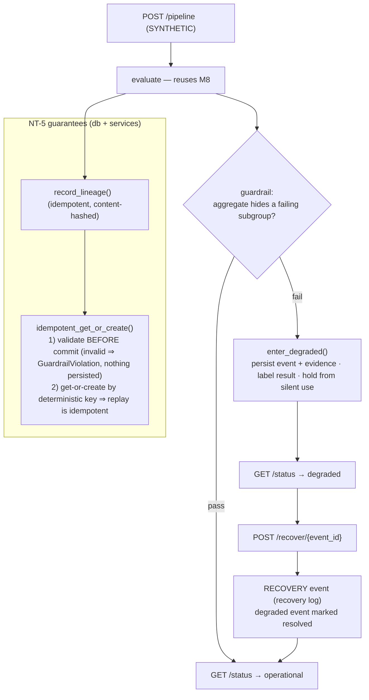

# Integration — Degraded Mode, Recovery & NT-5 (Milestone 15)

M15 wires the end-to-end system together and adds the **operability** guarantees the plan requires
(FR-7 / NFR-6): a documented **degraded mode + recovery**, and the **NT-5** persistence guarantees
(*detect an invalid record before silent commit; replay is idempotent; lineage remains complete*). It
**reuses** the M13 API/DB and M8 evaluation — no new engine, no new dependency. Decisions:
[ADR-0015](../adr/ADR-0015-integration-degraded-recovery.md).

> **Honesty:** everything the integration layer runs is **SYNTHETIC / VALIDATION ONLY** (or a clearly
> labelled **DEMO** when a guardrail failure is injected to exercise degraded mode). No real-data metric is
> produced, and the M11 **MIXED** conclusion is untouched.

## Workflow

## Components (reuse-first)

| Area | Module | Responsibility |
|------|--------|----------------|
| Lineage / idempotency | `app/services/lineage_service.py` | `record_lineage`, `idempotent_get_or_create` (**detect-before-commit**), `get_chain`, `list_lineage`. |
| Degraded / recovery | `app/services/integration_service.py` | `check_aggregate_hides_subgroup` guardrail, `enter_degraded`, `recover`, `system_status`, `run_masking_pipeline`. |
| Persistence | `app/db/models.py` | `LineageRow`, `SystemEventRow` (recovery log). |
| API | `app/api/routers/status.py` | `GET /status`, `POST /recover/{event_id}`, `GET /lineage`, `POST /pipeline`. |
| UI | `frontend/src/pages/Status.tsx` | live status, run pipeline (healthy / inject-degraded DEMO), recover, lineage table (additive to M14). |

## NT-5 (the M15 negative test)

*Field/authoritative observations do not support the inference.* The system must:

1. **Detect before silent commit** — every record is validated *before* any write; an invalid record
   raises `GuardrailViolation` and the transactional session leaves the DB untouched (no partial rows).
2. **Idempotent replay** — operations are keyed by a deterministic `stable_hash`; replaying the same
   operation returns the existing row (one row, same result), backed by SQLite UNIQUE constraints.
3. **Complete lineage** — `record_lineage` writes a queryable provenance chain (artifact + inputs + parent);
   `GET /lineage` and `get_chain` expose it.

Verified by `backend/tests/test_integration.py` (10 checks) + a live degraded→recovery→operational smoke
through the Vite proxy.

## Degraded mode & recovery

A **guardrail** detects a strong aggregate concealing a failing critical subgroup (high pixel accuracy but
weak thin-cloud / worst-class IoU — the FR-7 / NT-1 family). On failure the system **enters degraded mode**:
it persists a `DEGRADED` `SystemEventRow` with evidence, **labels the affected result** and holds it from
silent use. **Recovery** (`POST /recover/{event_id}`) resolves the event and appends a `RECOVERY` event —
the retained recovery log. Both are idempotent. `GET /status` is `operational` unless a `DEGRADED` event is
unresolved.

## Deferred

NT-1..NT-4 fixtures + the full acceptance harness (**M16**); Docker/compose deployment (**M17**); Postgres,
distributed locking, async workers, auth.
