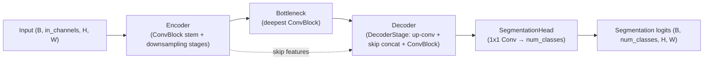

# Models

Milestone 6 delivers the **baseline model architecture and metadata infrastructure** under
`backend/app/models/`. It contains **no training/optimisation/loss/evaluation/inference code**. PyTorch is a
**guarded optional dependency**: the package imports on a bare interpreter and raises a clear `ModelError`
on model construction when torch is absent. Architecture decision: [ADR-0006](../adr/ADR-0006-baseline-model-selection.md).

## Modules

| Module | Responsibility |
|--------|----------------|
| `_torch.py` | Guarded torch access (`torch_available`, `require_torch`). |
| `config.py` | `ModelConfig` (+ `Activation`, `Normalization`) — validated, deterministic `config_hash`. |
| `base.py` | `BaseSegmentationModel` interface (torch-guarded). |
| `unet.py` | Baseline **U-Net**: `Encoder` / `DecoderStage` / `SegmentationHead`, `build_unet`. |
| `initialization.py` | `InitStrategy` (Xavier/Kaiming/Constant/Identity) + selection/application. |
| `summary.py` | `ModelSummary` + `count_parameters` / `summarize`. |
| `metadata.py` | `ModelMetadata`, `CheckpointMetadata`, `ExperimentMetadata` (JSON serialisation). |
| `blocks.py` | Shared building blocks (`ConvBlock`/`Encoder`/`SegmentationHead`) reused by U-Net + Attention U-Net. |
| `attention_unet.py` | **Improved** Attention U-Net (`build_attention_unet`); M10, [improved_model.md](improved_model.md). |
| `comparison.py` | `ArchitectureProfile` / `ArchitectureComparison` + `profile_architecture` / `compare_architectures`. |
| `registry.py` | `ModelRegistry` (register/lookup/aliases/tags/version + capabilities) + `default_registry` (unet + attention_unet). |
| `factory.py` | `ModelFactory` (config → model, summary, checkpoint metadata, artifact; records per-architecture version). |
| `artifact.py` | `ModelArtifact` — canonical saved-model metadata (no weights) + deterministic content hash. |

## Baseline architecture (U-Net)



A clean, configurable U-Net with separated **encoder / decoder / head**:

- **Encoder** — stem `ConvBlock` + `encoder_depth` downsampling stages (channels double each stage).
- **DecoderStage** — transposed-conv upsample → concatenate matching skip → `ConvBlock`.
- **SegmentationHead** — 1×1 conv to per-class logits `(B, num_classes, H, W)`.

Configurable via `ModelConfig`: `in_channels`, `num_classes`, `encoder_depth`, `base_channels`,
`activation` (relu/leaky_relu/gelu/elu), `normalization` (batch/group/instance/none), `dropout`. It is
built to **plug into training (M7) and inference (M13) unchanged**.

## Registry & capability metadata

`ModelRegistry` maps architecture names (and aliases) to builder callables + `ModelMetadata`.
`default_registry()` registers `unet` (aliases `baseline`, `unet2d`). Registry lookup and metadata require
no torch; **building** a model does.

`ModelMetadata` carries **capability metadata** describing what an architecture supports (empty list =
unconstrained):

| Field | Meaning (baseline U-Net) |
|-------|--------------------------|
| `supported_input_channels` | `[4, 13]` — On Cloud N (4) / CloudSEN12 L1C (13). |
| `supported_output_classes` | `[2, 4]` — binary / multi-class. |
| `minimum_patch_size` | `16` (2**encoder_depth for the default depth 4). |
| `optional_dependencies` | `["torch"]`. |
| `supported_normalization` | `batch`, `group`, `instance`, `none`. |
| `supported_preprocessing_versions` | current `PREPROCESSING_VERSION`. |

All capability fields serialise via `ModelMetadata.to_dict`/`from_dict`.

```python
from app.models import ModelConfig, ModelFactory
factory = ModelFactory()
summary = factory.summary(ModelConfig(in_channels=13, num_classes=4))   # requires torch
```

## Initialization & initialization reporting

`get_initializer(strategy)` returns a callable (dependency-free selection); `apply_initialization(model,
strategy)` applies it (requires torch). Strategies: **Xavier**, **Kaiming**, **Constant**, **Identity**
(Dirac/eye where applicable). No optimizer code.

`apply_initialization(model, strategy, return_report=True)` returns `(model, InitializationReport)`. The
report records: `strategy`, `modules_initialized`, `parameter_tensors_initialized`, `skipped_modules`
(leaf layers not initialised, e.g. norm layers), and `timestamp` — and serialises via `to_dict`.

**Initialization lifecycle:** `ModelFactory.create(config)` → `apply_initialization(model, strategy,
return_report=True)` → `(model, InitializationReport)` → (report serialised alongside artifact metadata).
No weights are saved.

## Metadata flow, relationships & artifact lifecycle

```
ModelConfig ──config_hash──▶ ModelFactory.create ──▶ model (torch)
     │                               │
     │                               └─ summarize ──▶ ModelSummary (param counts)
     ▼
CheckpointMetadata (model_id, architecture, versions, config_hash, parameter_count)
     ▼
ModelArtifact (artifact_id, model_id, versions, dataset_version, checkpoint_metadata, content_hash)
     │                                                                          ── JSON ──▶ file
ExperimentMetadata (experiment_id, dataset, versions, config_hash, checkpoint)  ── JSON ──▶ file
```

- **`CheckpointMetadata`** — *what would be saved* (model id, architecture, model/preprocessing/
  visualization versions, timestamp, config hash, parameter count, notes). **No weights are saved** in this
  milestone; weight persistence arrives with training (M7).
- **`ModelArtifact`** — the **canonical saved-model metadata object** (no weights). It aggregates the
  model id, architecture, model/preprocessing/visualization/**dataset** versions, the embedded
  `CheckpointMetadata`, and `config_hash`, and exposes a **deterministic `content_hash`** (over identity
  fields, ignoring `created_at`/`notes`). `artifact_id` defaults to `<architecture>-<content_hash[:12]>`.
  Built via `ModelFactory.build_artifact(config, dataset_version=…)`.
- **`ExperimentMetadata`** — links a dataset + preprocessing/visualization/model versions + config hash +
  checkpoint metadata (no metrics yet — those arrive with evaluation, M8).

**Metadata relationships:** `ModelConfig` → `config_hash` feeds both `CheckpointMetadata` and
`ModelArtifact`; `ModelArtifact` embeds a `CheckpointMetadata`; `ExperimentMetadata` embeds a
`CheckpointMetadata` and shares the `config_hash`. All of `CheckpointMetadata`, `ModelArtifact`, and
`ExperimentMetadata` serialise to JSON (`to_json`/`from_json`, `save_json`/`load_json`).

**Artifact lifecycle:** `ModelConfig → ModelFactory.build_artifact → ModelArtifact.save_json(...) → …
ModelArtifact.load_json(...)`. Config/content hashing uses the shared `app.utils.hashing.stable_hash`, so
identical configs/identities yield identical hashes (deterministic, reproducible).

## CLI

```bash
python backend/scripts/model_info.py --name unet --in-channels 13 --classes 4
```
Prints the config + hash; with torch present, also the parameter counts and a `CheckpointMetadata` JSON.
Without torch it degrades to config-only output.
