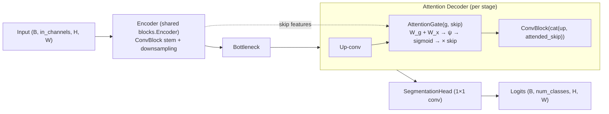

# Improved Model — Attention U-Net (Milestone 10)

The improved architecture is **Attention U-Net** (U-Net + additive attention gates on skip connections),
selected in [ADR-0010](../adr/ADR-0010-improved-model-selection.md). It is registered **alongside** the
baseline U-Net and reuses the existing model abstraction and shared building blocks.

> **Performance is NOT claimed here.** M10 establishes the architecture + comparison infrastructure only.
> Whether it actually improves over U-Net (especially on thin cloud) is **NOT YET MEASURED** and awaits
> controlled training (M7) + evaluation (M8) + failure analysis (M9) in later milestones.

## Architecture



The **only** difference from U-Net is the decoder: each skip connection passes through an `AttentionGate`
(two 1×1 conv projections `W_g`, `W_x` → ReLU → 1×1 conv `ψ` → sigmoid) that produces a per-pixel [0,1]
attention map re-weighting the skip before concatenation.

## Baseline vs improved

| Aspect | U-Net (baseline) | Attention U-Net (improved) |
|--------|------------------|----------------------------|
| Skip fusion | plain concatenation | **attention-gated** concatenation |
| Encoder / ConvBlock / head | shared (`app.models.blocks`) | **same shared blocks** |
| Config | `ModelConfig` | **same `ModelConfig`** (`name="attention_unet"`) |
| Version | `MODEL_VERSION` (0.6.0) | `IMPROVED_MODEL_VERSION` (0.10.0) |
| Extra params | — | 3× 1×1 conv per decoder stage (small) |

## Improvement hypothesis

*Attention gates re-weight skip features by relevance, which should help difficult cloud classes (thin
cloud) and boundary failures without unreasonable compute cost.* This is a **hypothesis to be tested**, not
a result. The intended mechanism is recorded in the model metadata (`improvement_mechanism`,
`improves_over`).

## Candidate comparison (from ADR-0010)

U-Net · **Attention U-Net (selected)** · UNet++ · DeepLabV3+ · SegFormer were scored on segmentation
quality, thin/thick/shadow behaviour, boundary handling, parameter count, MPS memory/compatibility,
implementation complexity, training cost, and reproducibility. Attention U-Net was chosen as the **lowest-
risk, MPS-friendly** first improvement that directly targets thin-cloud discrimination. DeepLabV3+ / UNet++
are retained as **future comparison models (M11)**; SegFormer is optional.

## Parameter comparison

Parameters and output shapes are **MEASURED** by `app.models.comparison.profile_architecture` (build +
synthetic forward). For a `4→2`, depth-2, base-8 config: U-Net = **29,706**, Attention U-Net = **30,116**
(**+410**, ≈ +1.4%). Exact counts scale with width/depth; use `model_compare.py` for any config.

## Compute limitations

- **Memory:** `NOT_MEASURED` — not fabricated.
- **FLOPs:** `DEFERRED` — no reliable dependency-light measurement method is adopted yet.
- **Hardware throughput:** not measured; no performance claims.

## MPS / CPU considerations

The attention gate uses only `Conv2d`, `BatchNorm2d`, `ReLU`, `Sigmoid`, and `interpolate` — all
CPU/MPS-compatible. **No CUDA-specific operations** are used. Device selection remains the project default
(`cuda > mps > cpu`); the model runs on CPU and MPS.

## Experiment plan (later milestones)

Under the frozen AC-4 envelope, train U-Net and Attention U-Net with the **same** data/config/seed;
evaluate with M8 (per-class + stratified, esp. **thin cloud**); analyse failures with M9; compare
parameters + metrics with the M10 comparison records. A meaningful improvement must show **per-class
(thin-cloud) gains at a reasonable compute cost** — a negative result is an acceptable, honest outcome.

## CLI

```bash
python backend/scripts/model_compare.py --in-channels 13 --classes 4 --patch 128
```
Prints/writes a structured comparison (parameters, config, input/output shape, availability, measurement
status). Everything not measured is labelled `NOT_MEASURED` / `DEFERRED` / `NOT YET MEASURED`.

## First real evidence (2026-08-20) — MEASURED, bounded

A first **real** controlled comparison on a bounded CloudSEN12+ subset (32 samples, 12 epochs, 3 seeds, MPS)
found that Attention U-Net **consistently improves the primary thin-cloud metric** (IoU mean **+0.050**;
recall and false-negatives better in every seed) at ~1.01× params / ~1.2–1.3× training time — first real
support for the attention-gate hypothesis. It also **consistently regresses cloud shadow** slightly, so the
overall verdict is **MIXED** (not a uniform winner, no forced conclusion). This is **not** the AC-4 benchmark
and does not populate the formal KPIs. Full detail + per-class/per-seed numbers:
[`../comparison/real_experiment_cloudsen12.md`](../comparison/real_experiment_cloudsen12.md).
