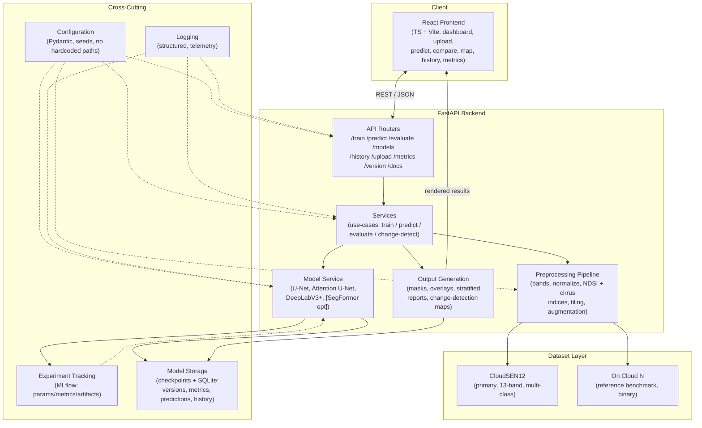

# System Architecture (Planned)

> **Deliverable ID:** D1 (partial) · **Milestone:** M1 · **Status:** DRAFT for approval
> Detailed module code arrives in later milestones; this is the **planned** clean-architecture layout and
> the data/evidence flow it must implement.

---

## 1. Clean-Architecture Principle

Dependencies point **inward**. Domain logic (models, metrics, masking rules) must not depend on delivery
mechanisms (FastAPI, React, SQLite). Concretely:

```
core/  (entities, config, contracts)  ← depended on by everything, depends on nothing
  ▲
services/  (use-cases: train, predict, evaluate, change-detect)
  ▲
api/  (FastAPI routers)     datasets/ preprocessing/ models/ training/ evaluation/ change_detection/  (adapters)
  ▲
frontend/  (React) · docker/ · scripts/   (delivery / orchestration)
```

## 1a. System Component Diagram



## 2. Repository Layout (as built in Milestone 2)

The Python backend is packaged under `backend/app/` (a single importable `app` package), with `configs/`,
`scripts/`, and `tests/` alongside it under `backend/`. Data/model/output artifacts are top-level and
git-ignored. This is the **actual** scaffold created in Milestone 2 (it refines the M1 sketch: package
nested under `app/`, `configs`+`scripts` moved under `backend/`, and `data/models/notebooks/outputs` added).

```
Cloud_Masking/
├── backend/
│   ├── app/                # importable "app" package (clean-architecture core inward)
│   │   ├── api/routers/    # FastAPI routers: train, predict, evaluate, models, history, upload, metrics, version (M13)
│   │   ├── core/           # config, constants, logging_config, exceptions (stdlib-only skeletons at M2)
│   │   ├── services/       # use-case orchestration (training/prediction/evaluation/change-detect)
│   │   ├── datasets/       # manifest/integrity/download (M3); CloudSEN12+On Cloud N loaders, splits (M4); M12: experimental_config, availability, records, validation_gates, sampling, dataset_statistics, artifact, readiness, pipeline, synthetic (reuses M3/M4/M5; M11 handoff)
│   │   ├── preprocessing/  # M4: records, config, loader, validation, patching, patch_manifest, normalization, splitting, augmentation, raster_io, pipeline
│   │   ├── visualization/  # M5: records, backends, colormap, statistics, inspection, bands, overlays, patches, plotting, reports, qc, manifest, session, exporters
│   │   ├── models/         # M6: config, base, blocks, unet, initialization, summary, metadata, artifact, registry, factory · M10: attention_unet (improved), comparison (deeplabv3+/unet++ future)
│   │   ├── inference/      # tiled prediction, stitching, telemetry
│   │   ├── training/       # M7: config, seed, optimizer, scheduler, loss, metadata, logging, checkpoint, callbacks (events+priorities), engine, experiment, lifecycle (TrainerState), artifact (TrainingArtifact), trainer
│   │   ├── evaluation/     # M8: config, confusion, metrics, aggregation, records, runner, stratification, summary, report, serialization, binary
│   │   ├── failure_analysis/ # M9: taxonomy, config, records, pixel_analysis, sample_analysis, ranking, stratification, analyzer, viz_specs, report (reuses M8/M5)
│   │   ├── comparison/     # M11: config (single-source ComparisonConfig), guardrails (fairness), records (ModelComparisonArtifact), metrics, failures, decision, runner, viz_specs, report, serialization (reuses M7/M8/M9/M5)
│   │   ├── change_detection/ # change-detection task + masking-impact measurement
│   │   ├── db/             # SQLite models + migrations (model versions, metrics, predictions, history)
│   │   ├── schemas/        # Pydantic request/response DTOs (empty package at M2; implemented M13)
│   │   ├── utils/          # geo utils (CRS/registration), io, seeding, reproducibility
│   │   └── main.py         # FastAPI app factory placeholder (returns None at M2; M13)
│   ├── tests/              # structure + import tests (M2); unit/integration/api/model from M6
│   ├── configs/            # config.template.yaml, smoke.yaml, full.yaml, logging.yaml
│   ├── scripts/            # download, validate, preprocess, split, stats, train, evaluate, predict, run_reference (M3+)
│   ├── pyproject.toml      # metadata + pytest/ruff/black/mypy config (requires-python >=3.11,<3.12)
│   ├── requirements.in · requirements-dev.in · .env.example · README.md   # lock (requirements.txt) deferred to pip-compile
├── frontend/
│   └── src/{components,pages,services,hooks,utils,assets}/   # + package.json, .env.example, README (M14)
├── docker/                 # backend/frontend Dockerfiles + docker-compose.yml (placeholders; M17)
├── docs/                   # planning/ · adr/ (M1); dataset/install/user/dev/deploy guides (M18)
├── data/                   # raw/{cloudsen12,on_cloud_n} external/ (git-ignored) · manifests/ metadata/ samples/ (tracked)
├── models/                 # checkpoints/ trained weights (git-ignored)
├── experiments/            # curated experiment logs, ablations, metric summaries, sweeps (M7+)
├── notebooks/              # supplementary only — never a deliverable
├── outputs/                # logs · mlruns · sqlite · run artifacts (git-ignored)
├── paper/                  # literature review, references, comparison tables, ablation template (M19)
├── presentation/           # poster + slides + demo (M20)
├── reports/                # generated evaluation & validation reports / evidence (M8+)
├── .github/workflows/      # CI YAML placeholders (created, manual-only until owner enables)
├── .gitignore · .env.example
└── README.md
```

## 3. Data & Evidence Flow (implements Architecture A + B)

1. **Ingest** CloudSEN12 → validate provenance, CRS, bands, units, no-data (FR-1, NFR-3).
2. **Preprocess** → band selection, per-band normalization, spectral indices (NDSI for snow, cirrus B10 for
   thin cloud), patch tiling, augmentation (Albumentations).
3. **Spatial-block split** → train/val/test with **no spatial leakage** (NFR-4); reserve AC-3 acceptance set
   **before** any O3 tuning.
4. **Train** models (MLflow-tracked) with fixed seeds under the frozen resource envelope (AC-4).
5. **Evaluate** → overall + **stratified** (thin cloud / haze / snow / bright surface) + cross-region /
   cross-season; guardrails prevent aggregate hiding subgroup failure.
6. **Change detection** → feed masks into a bi-temporal change task; measure how masking errors change the
   detected-change score (O4).
7. **Serve** → FastAPI endpoints; React app for upload/predict/compare/map/history/metrics.
8. **Assure** → acceptance harness runs AC-1..4 + NT-1..5; independent review (O5).

## 4. Key Architecture Decision Records (see `docs/adr/`)

- **ADR-0001** — Dataset selection: **CloudSEN12** primary + **On Cloud N** reference benchmark (both retained). *(ACCEPTED)*
- **ADR-0002** — Compute environment: **Mac MPS/CPU** with config-driven device auto-detection + smoke profile. *(ACCEPTED)*
- **ADR-0003** — Change-detection evaluation source (candidate OSCD). *(DEFERRED to M12)*
- **ADR-0004** — Python runtime: pin **Python 3.11.x** (host 3.14 wheel-availability risk R-01). *(ACCEPTED)*
- **ADR-0006** — Baseline model: **U-Net** (encoder/decoder/head), reusable for training/inference. *(ACCEPTED)*
- **ADR-0007** — Training strategy: custom config-driven Trainer (AdamW/Cosine defaults, callbacks, checkpoints, deterministic). *(ACCEPTED)*
- **ADR-0008** — Evaluation strategy: confusion-first, per-class + stratified metrics; no aggregate hides thin-cloud; undefined explicit. *(ACCEPTED)*
- **ADR-0009** — Confusing-case analysis: taxonomy + measurability; explains failures (reuses M8); deterministic ranking; confidence deferred. *(ACCEPTED)*
- **ADR-0010** — Improved model: **Attention U-Net** (attention-gated skips) alongside the baseline; reuses model abstraction; performance NOT YET MEASURED. *(ACCEPTED)*
- **ADR-0011** — Controlled comparison: single-source `ComparisonConfig` + fairness guardrails; thin-cloud-primary decision framework; reuses M7/M8/M9; honest status labels; INCONCLUSIVE until real results. *(ACCEPTED)*
- **ADR-0012** — Experimental dataset & data pipeline: CloudSEN12+ primary (multiclass); On Cloud N reference-only (redistribution prohibited); deterministic curated subset + group-aware split + train-only normalization; readiness gate + M11 handoff; reuses M3/M4/M5; NOT PRESENT until data fetched. *(ACCEPTED)*
- **ADR-0010** — Improved model: **Attention U-Net** (attention-gated skips), MPS-friendly, low-risk; DeepLabV3+/UNet++ future. Performance NOT YET MEASURED. *(ACCEPTED)*

## 5. Cross-Cutting Concerns

- **Runtime:** **Python 3.11.x** (pinned; see ADR-0004), PyTorch stable with Apple-Silicon (MPS) support.
- **Config:** Pydantic-validated, no hardcoded paths (env/CLI/config file); seeds recorded.
- **Logging:** structured logging in every module; request/telemetry logging in API.
- **Errors:** typed exceptions in `core/exceptions.py`; no bare excepts.
- **Reproducibility:** deterministic seeding, pinned versions, scripted runbook.
- **Testing:** pytest with unit/integration/api/model layers; fixtures for negative tests.
