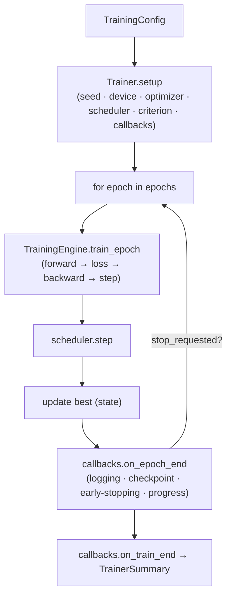
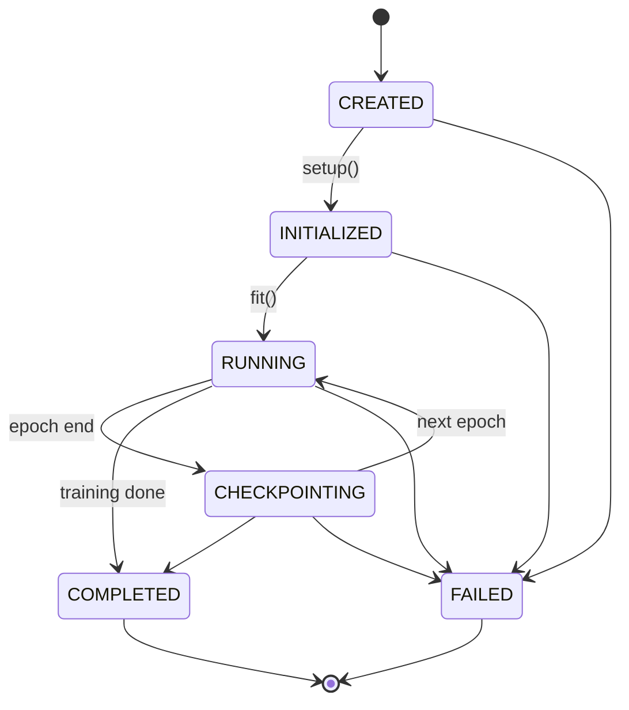
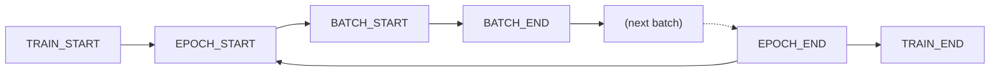

# Training Engine

Milestone 7 delivers the **training infrastructure** under `backend/app/training/` — a reusable,
configuration-driven `Trainer`. It contains **no evaluation metrics, benchmarks, deployment, API, or
frontend code**; validation metrics plug in later (M8) via a callback / `metrics_fn` without changing the
trainer. PyTorch is a **guarded optional dependency**. Decisions: [ADR-0007](../adr/ADR-0007-training-strategy.md).

## Modules

| Module | Responsibility |
|--------|----------------|
| `config.py` | `TrainingConfig` (+ optimizer/scheduler/loss/checkpoint/logging/early-stopping sub-configs) + deterministic `config_hash`. |
| `seed.py` | Seeding, deterministic flags, environment/version capture, device resolution. |
| `optimizer.py` | Optimizer registry (Adam / AdamW / SGD) — config-driven. |
| `scheduler.py` | Scheduler registry (CosineAnnealingLR / StepLR / ReduceLROnPlateau). |
| `loss.py` | Training criterion (cross-entropy / soft Dice / combined) — the optimization objective. |
| `metadata.py` | `TrainingState`, `CheckpointState`, `TrainingMetadata`, `TrainerSummary`. |
| `logging.py` | `MetricSink` abstraction + `JsonlSink`/`CsvSink`/`ConsoleSink` + `TrainingLogger`. |
| `checkpoint.py` | `CheckpointManager` (best/latest, save policy, resume metadata). |
| `callbacks.py` | `Callback`, `CallbackList`, `CallbackEvent`, `CallbackPriority`, and the built-in callbacks. |
| `engine.py` | `TrainingEngine` — epoch mechanics (forward/loss/backward/accumulation/AMP). |
| `experiment.py` | `ExperimentRun` + `create_experiment` (directory layout). |
| `lifecycle.py` | `TrainerState` enum + `TrainerStateMachine` (validated transitions). |
| `artifact.py` | `TrainingArtifact` — canonical completed-run metadata (deterministic hash). |
| `trainer.py` | `Trainer` — orchestrates model/optimizer/scheduler/criterion + epochs + callbacks. |

## Training lifecycle



`Trainer.fit()` returns a serialisable `TrainerSummary`. The trainer accepts any iterable of
`(inputs, targets)` batches, so it is **independent of the dataset layer** (M4 loaders plug in later).

## Trainer state machine (`TrainerState`)



`TrainerStateMachine.transition_to()` raises `TrainingError` on any transition not in the diagram; the
trainer exposes the current state via `trainer.trainer_state`. `COMPLETED` and `FAILED` are terminal.

## Callback events, dispatch flow & priorities

Dispatch is driven by the typed `CallbackEvent` enum — **no string event names**:
`TRAIN_START · EPOCH_START · BATCH_START · BATCH_END · EPOCH_END · TRAIN_END`.



`CallbackList` executes callbacks in **explicit priority order** (not registration order) via
`CallbackPriority`: `HIGHEST(0) → HIGH(25) → NORMAL(50) → LOW(75) → LOWEST(100)`. Ties (equal priority)
keep registration order (stable sort), so dispatch is deterministic. Default callback priorities:

| Callback | Priority | Rationale |
|----------|----------|-----------|
| `LoggingCallback` | HIGH | Record metrics first. |
| `CheckpointCallback` | NORMAL | Save latest/best after logging. |
| `EarlyStoppingCallback` | LOW | Decide to stop after the checkpoint is saved. |
| `ProgressCallback` | LOWEST | Emit the final progress line. |

Callbacks are **independent** of the trainer and receive a `CallbackContext` (config, state, metrics,
model, optimizer, scheduler, logger, checkpoint_manager).

## TrainingArtifact lifecycle

`TrainingArtifact` is the canonical metadata for **one completed training execution** — it aggregates the
`experiment_run`, `model_artifact`, `training_metadata`, `checkpoint_state`, `training_config_hash`, and
`environment_capture` (no evaluation metrics / inference outputs / deployment metadata). It has a
**deterministic `content_hash`** (identity fields only; `artifact_id = train-<hash[:12]>`) and JSON
export/import (`to_json`/`from_json`, `save_json`/`load_json`).

```
Trainer.fit() → Trainer.build_training_artifact(experiment_run, model_artifact) →
TrainingArtifact.save_json(artifacts/training_artifact.json)  →  … load_json(...)
```

## Checkpoint lifecycle

`CheckpointManager` writes, per checkpoint, model/optimizer/scheduler `state_dict`s (**weights optional**)
plus a JSON `CheckpointState` sidecar (always). Policy: **best** (by monitored value under `mode`) +
**latest**. Resume reads the sidecar (`resume_metadata`) and payload (`load`). Evaluation metrics, if ever
present, are **optional metadata only** — never computed here.

## Optimizer & scheduler abstraction

Both are small **registries** selected by name from config — no hardcoded choice:

- Optimizers: `adam`, `adamw` *(default)*, `sgd` → `build_optimizer(params, OptimizerConfig)`.
- Schedulers: `cosine` *(default)*, `step`, `plateau`, or `none` → `build_scheduler(optimizer, SchedulerConfig, epochs)`.
  `ReduceLROnPlateau` steps on the monitored metric (`steps_on_metric`).

## Reproducibility strategy

`set_seed(seed, deterministic=…)` seeds Python/NumPy/PyTorch (+CUDA) and optionally requests deterministic
algorithms; `capture_environment()` records Python/torch/numpy versions and CUDA/MPS availability into
`TrainingMetadata`. `resolve_device("auto")` picks `cuda > mps > cpu`. AMP is opt-in and CUDA-only;
gradient accumulation (`grad_accum_steps`) reaches larger effective batches on MPS (ADR-0002).

## Experiment directory (ADR-0007)

```
outputs/experiments/<experiment_id>/
├── config.json · run.json
├── checkpoints/  (best.pt/json · latest.pt/json)
└── logs/         (metrics.jsonl · metrics.csv)
```

## CLI (synthetic, no real dataset)

```bash
python backend/scripts/train_smoke.py --epochs 2 --device cpu
```
Runs a short synthetic training run and writes an experiment. Requires PyTorch; degrades to config-only
output otherwise.
