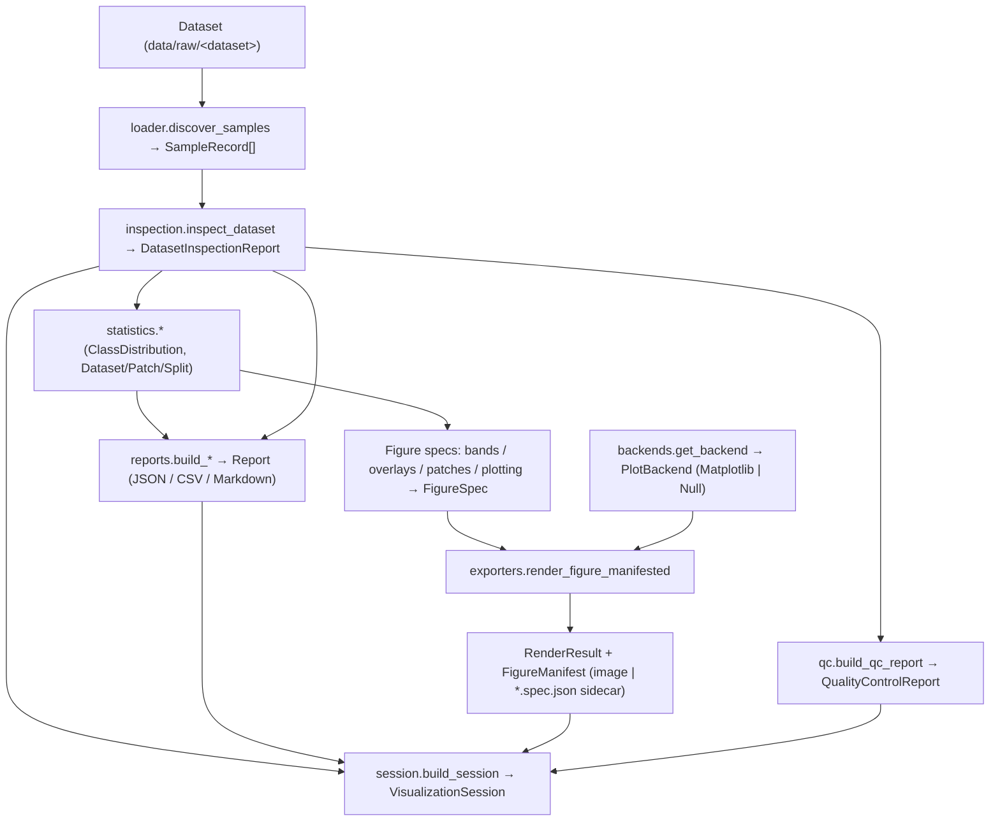

# Visualization & Exploratory Data Analysis (EDA)

Milestone 5 delivers a reusable, **ML-independent** visualization + EDA layer under
`backend/app/visualization/`. It is **backend-independent**: callers exchange serialisable `FigureSpec` /
`RenderResult` objects and never touch plotting-library classes. matplotlib is a **guarded optional
dependency** — when it is absent, statistics, reports, and figure *metadata* are still produced (graceful
degradation).

## Modules

| Module | Responsibility |
|--------|----------------|
| `records.py` | `FigureSpec`, `RenderResult`, `Legend`/`LegendEntry`, enums. |
| `backends.py` | `PlotBackend` abstraction — `NullBackend`, `MatplotlibBackend`, `get_backend`. |
| `colormap.py` | `ClassColor`, `ColorMap`, default palettes, legend generation. |
| `statistics.py` | `ClassDistribution`, `DatasetStatistics`, `PatchStatistics`, `SplitStatistics`. |
| `inspection.py` | `DatasetInspectionReport` + `inspect_dataset`. |
| `bands.py` | RGB / false-colour / single-band spec builders. |
| `overlays.py` | Ground-truth mask + overlay spec builders (no predictions). |
| `patches.py` | `PatchGridMetadata` + patch-grid spec (reuses `PatchRecord`). |
| `plotting.py` | Chart spec builders (class distribution, splits, patches, sizes). |
| `reports.py` | `Report`/`ReportSection` + JSON/CSV/Markdown export + builders. |
| `qc.py` | `QualityControlReport` + Markdown. |
| `manifest.py` | `FigureManifest` (per-figure metadata) + deterministic `stable_hash`. |
| `session.py` | `VisualizationSession` (primary workflow object) + `build_session`. |
| `exporters.py` | `render_figure`(`_manifested`), `render_all`(`_manifested`), `export_report`. |

## Visualization workflow



Every arrow carries a **typed, serialisable** object — no plotting-library object crosses a boundary.

## Backend abstraction (plotting is swappable)

`FigureSpec` describes a figure with **serialisable** data only (labels/values, or file-path references for
rasters). A `PlotBackend` turns a spec into an image and returns a `RenderResult`:

- `MatplotlibBackend` — renders with matplotlib (non-interactive `Agg`). The **only** module that imports
  matplotlib.
- `NullBackend` — always available; writes a `*.spec.json` **metadata sidecar** and returns `DEGRADED`.
- `get_backend("auto")` picks matplotlib if importable, else null.

Swapping in another backend (e.g. Plotly) means implementing `PlotBackend` — no caller changes, no
library objects in the public API.

## Visualization workflow

```
FigureSpec (bands/overlays/patches/plotting) ──▶ exporters.render_figure(spec, path, backend=auto)
                                              ──▶ RenderResult (RENDERED image | DEGRADED sidecar)
```

- **Band composites:** `rgb_composite_spec`, `false_color_spec`, `single_band_spec` (dataset-aware default
  band indices). Rendering reads the raster via the guarded reader and degrades if rasterio is absent.
- **Labels (ground truth only):** `mask_spec`, `overlay_spec` (+ `alpha`), `legend_for(colormap)`.
- **Patch grids:** `patch_grid_metadata` / `patch_grid_spec` from `PatchRecord`s — boundaries, overlap,
  indices.

## Reporting workflow

`statistics.*` compute deterministic summaries from **preprocessing records**; `reports.build_*` assemble
them into a `Report`; `exporters.export_report` writes files.

- **Supported exports:** **JSON**, **CSV** (all sections flattened with a `section` column), **Markdown**.
- Builders: `build_dataset_report`, `build_patch_report`, `build_split_report`,
  `build_preprocessing_report`, `class_frequency_section`.
- Statistics covered: class frequency, dataset summaries, patch summaries, split summaries, preprocessing
  summaries.

## QC workflow

`qc.build_qc_report(dataset, validation_report)` reuses the preprocessing `ValidationReport` and yields a
structured `QualityControlReport` (missing labels, corrupted samples, invalid dimensions, duplicate
identifiers, unsupported files, preprocessing warnings) plus `to_markdown()`.

```bash
python backend/scripts/eda_report.py --dataset on_cloud_n        # EDA (json/md/csv) + QC (md)
python backend/scripts/eda_report.py --dataset cloudsen12 --backend null
```

## Colour-mapping strategy

`ColorMap` maps class indices → accessible hex colours with deterministic ordering and `legend()`
generation. Defaults: `cloudsen12` (clear/thick/thin/shadow) and `on_cloud_n` (no_cloud/cloud). Snow/bright
surfaces fall under **clear** (no dedicated class). Colours are hex strings — no plotting dependency — so
legends serialise and render on any backend.

## FigureManifest (per-figure metadata)

`FigureManifest` records the metadata for a single generated figure — never a plotting object. Fields:
`figure_id`, `title`, `figure_type`, `backend`, `created_at`, `visualization_version`, `config_hash`,
`input_source`, `output_files`, `notes`. It supports `to_json`/`from_json` and `save_json`/`load_json`
(export/import). `FigureManifest.from_render(spec, result)` builds one from a `FigureSpec` + `RenderResult`;
`config_hash = stable_hash(spec)` is deterministic, and `figure_id` defaults to `<slug(title)>-<hash[:8]>`.

Every rendering operation can **optionally** produce a manifest:
`exporters.render_figure_manifested(spec, path)` returns `(RenderResult, FigureManifest)`, and
`render_all_manifested` does the same for many figures.

## VisualizationSession (primary workflow object)

`VisualizationSession` represents one visualization execution and is the object visualization workflows
return. Fields: `session_id`, `timestamp`, `visualization_version`, `config_hash`, `dataset_summary`,
`figures` (`list[FigureManifest]`), `reports` (`list[ReportRef]`), `qc_report`, `output_dir`. It supports
`to_json`/`from_json` and `save_json`/`load_json`. `build_session(dataset, inspection, config=…)` seeds a
session with a deterministic `config_hash = stable_hash(config)` and `session_id = <dataset>-<hash[:8]>`;
callers attach figures/reports via `add_figure` / `add_report`. `backend/scripts/eda_report.py` writes a
`<dataset>_session.json` as its top-level artifact.

## Rendering lifecycle

```
FigureSpec ─▶ get_backend("auto") ─▶ backend.render(spec, path) ─▶ RenderResult
                                                              └▶ FigureManifest.from_render(spec, result)
```

1. A spec builder produces a serialisable `FigureSpec`.
2. `get_backend` selects Matplotlib (if importable) or the Null backend.
3. The backend renders an image (`RENDERED`) or, when it cannot, writes a `*.spec.json` sidecar
   (`DEGRADED`) — never raising.
4. A `FigureManifest` captures the outcome (config hash, backend, output files) for provenance.

## Metadata & report generation flow

- **Metadata flow:** `FigureSpec` → `RenderResult` → `FigureManifest` → `VisualizationSession.figures`.
- **Report flow:** `statistics.*` + `inspection` → `reports.build_*` → `Report.save(JSON/CSV/MD)` →
  `VisualizationSession.reports` (as `ReportRef`s). QC: `qc.build_qc_report` → `VisualizationSession.qc_report`.
- The whole session serialises to one `session.json`, giving a reproducible, tool-independent record.

## Determinism & degradation

- Statistics and figure specs are deterministic given the same inputs (reports accept a fixed
  `created_utc`).
- With no plotting backend, `render_figure` returns `DEGRADED` and writes a spec sidecar; **all reports,
  statistics, and metadata remain fully functional.**
