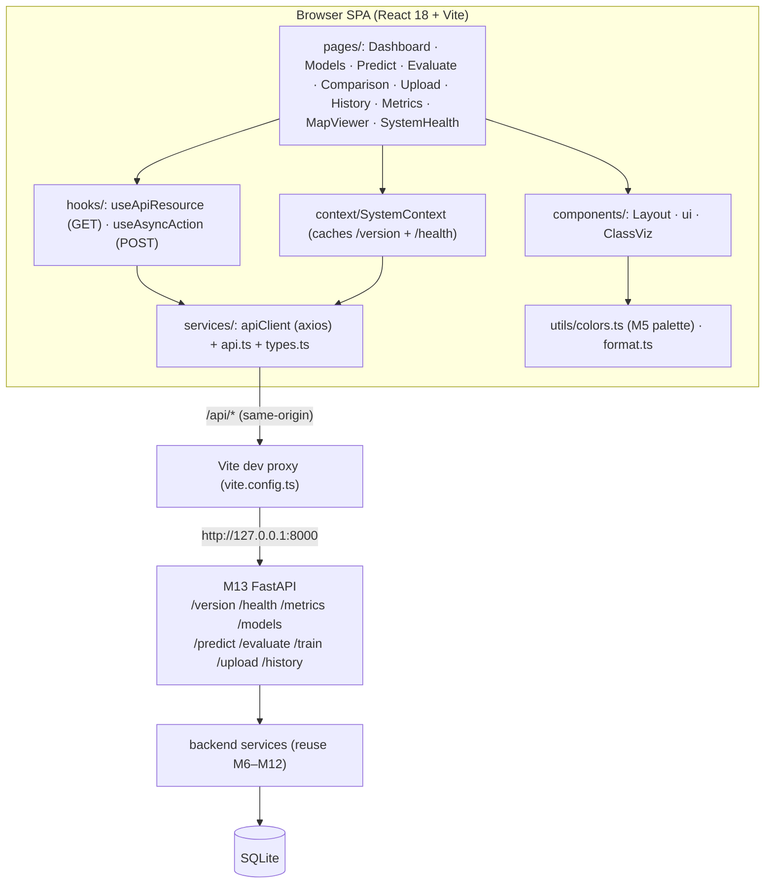

# Cloud Masking — Frontend (Milestone 14)

React + TypeScript + Vite single-page app that drives the **M13 FastAPI backend** for the core flows:
dashboard, models, prediction, evaluation, the real comparison, upload, history, telemetry, map, and
system/health. The frontend **consumes the API** through a centralized typed client — it never duplicates
backend domain logic (ADR-0014).

> **Honesty:** results from `/train` and `/evaluate` are **SYNTHETIC / validation-only** and are always
> badged as such. The one real experiment (bounded CloudSEN12+, 3 seeds) is shown on the **Comparison** page
> as **REAL (bounded, not AC-4)** with its **MIXED** conclusion transcribed verbatim from
> `../docs/comparison/real_experiment_cloudsen12.md` — no metric is invented and the conclusion is never
> reinterpreted. Pixel-mask rendering & geo-overlay are **DEFERRED** (the API returns class counts, not
> mask pixels); no mask is ever fabricated.

## Data flow



## Structure

```
frontend/src/
├── services/     # apiClient.ts (axios) · api.ts (one fn per endpoint) · types.ts (mirror M13 DTOs)
├── hooks/        # useApiResource · useAsyncAction  (loading / error / empty / data)
├── context/      # SystemContext (version + health, once)
├── components/   # Layout (nav+header) · ui (Card/Loading/ErrorState/EmptyState/MetricTile/RegimeBadge/JsonBlock) · ClassViz (legend/table/dist bar)
├── pages/        # one component per route
├── utils/        # colors.ts (CloudSEN12 palette, verbatim from M5) · format.ts
└── data/         # realComparison.ts (real M11 numbers, cited from the committed report)
```

## Configuration (environment-driven)

Copy `.env.example` → `.env.local` (git-ignored). Vite reads `VITE_`-prefixed vars:

- `VITE_API_BASE_URL` — axios base (default `/api`, i.e. the dev proxy; set to an absolute URL behind a
  reverse proxy in prod).
- `VITE_API_PROXY_TARGET` — where the Vite dev proxy forwards `/api/*` (default `http://127.0.0.1:8000`).
- `VITE_APP_NAME` — header title.

**CORS:** the dev proxy makes all API calls same-origin, so the backend needs **no CORS change**. No secrets
are stored in the frontend.

## Setup & run (Node ≥ 20)

```bash
cd frontend
npm install
npm run dev        # http://127.0.0.1:5173  (proxies /api -> backend on :8000)
```

Start the backend separately: `backend/.venv/bin/python backend/scripts/serve_api.py --port 8000`.

```bash
npm run typecheck  # tsc --noEmit (strict)
npm run build      # tsc --noEmit && vite build  ->  dist/
npm run preview    # serve the production build
```

## Stack

React 18 · TypeScript 5 (strict) · Vite 6 · react-router-dom 6 · axios · leaflet/react-leaflet (map). No
state-management library, no UI kit — hooks + a small context + hand-written CSS keep the bundle small and
auditable.
